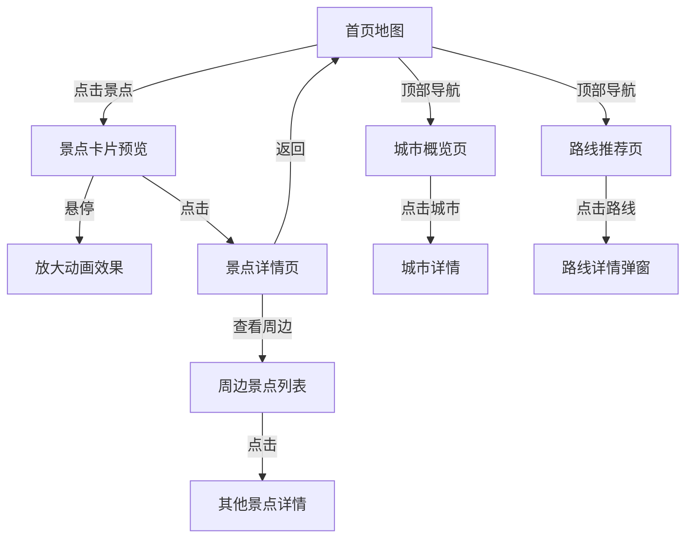

# 宁夏旅游地图网站 - 产品需求文档

## 1. 产品概述

**项目名称**: 宁夏旅游地图 - 塞上江南·神奇宁夏

**项目简介**: 一款专注于宁夏回族自治区旅游景点的交互式地图网站，融合现代设计美学与地域文化特色，为游客提供直观、便捷的旅游目的地探索体验。

**核心价值**:
- 展示宁夏独特的自然风光与人文景观
- 提供直观的地理信息和景点导航
- 传播宁夏的历史文化与民族特色
- 打造沉浸式的旅游规划体验

**目标用户**:
- 计划前往宁夏旅游的国内外游客
- 对西北文化感兴趣的研究者
- 本地居民探索家乡美景
- 旅游博主和内容创作者

---

## 2. 核心功能模块

### 2.1 主要页面

| 页面 | 核心模块 | 功能描述 |
|------|----------|----------|
| 首页 | 全屏地图 + 导航栏 + 景点标记 | 交互式地图为首页主体，景点以动态标记呈现 |
| 景点详情 | 图片画廊 + 文字介绍 + 周边推荐 | 展示景点详细信息，支持图片浏览和导航 |
| 城市概览 | 城市简介 + 特色美食 + 最佳时间 | 介绍宁夏5个地级市的历史文化 |
| 路线推荐 | 精选路线 + 时间规划 + 预算参考 | 提供多种主题旅游路线规划 |

### 2.2 功能模块

#### 2.2.1 交互式地图系统
- **SVG矢量地图**: 基于宁夏行政区划的精美矢量地图
- **景点标记**: 动态图标展示景点位置，支持悬停放大效果
- **缩放平移**: 支持鼠标滚轮缩放和拖拽平移
- **区域高亮**: 点击地级市区域高亮显示

#### 2.2.2 景点分类浏览
- **自然风光**: 沙湖、黄沙古渡、苏峪口国家森林公园
- **历史文化**: 西夏王陵、宁夏博物馆、镇北堡西部影城
- **宗教建筑**: 中卫高庙、南关清真寺
- **特色体验**: 沙坡头、黄河坛、鸣翠湖

#### 2.2.3 景点详情展示
- **高清图库**: 多角度展示景点风貌，支持灯箱浏览
- **详细描述**: 文字介绍景点的历史背景、游览亮点
- **实用信息**: 开放时间、门票价格、交通指南、最佳游览时间
- **周边景点**: 推荐同一地区的其他景点

#### 2.2.4 城市概览
- **银川市**: 首府，塞上湖城
- **石嘴山市**: 工业重镇，星海湖畔
- **吴忠市**: 回族之乡，黄河金岸
- **固原市**: 红色六盘，丝路古城
- **中卫市**: 沙漠水城，枸杞之乡

---

## 3. 用户交互流程

### 3.1 主要用户流程

```
用户访问首页
    ↓
浏览交互式地图，查看景点标记
    ↓
点击景点标记，查看景点卡片预览
    ↓
点击"查看详情"，进入景点详情页
    ↓
浏览图片和文字介绍
    ↓
查看实用信息和周边推荐
    ↓
返回继续探索其他景点
```

### 3.2 交互设计



---

## 4. 用户界面设计

### 4.1 设计风格

**主题定位**: 现代中式美学 + 西北地域特色

**色彩方案**:
- **主色调**: `#C4A35A` (沙金色 - 代表沙漠与丰收)
- **辅助色**: `#2D5A4A` (胡杨绿 - 代表绿洲与生态)
- **强调色**: `#E85D4C` (枸杞红 - 代表宁夏特产)
- **背景色**: `#F5F2EB` (暖白色 - 干净的阅读体验)
- **深色文字**: `#1A1A1A` (近黑色 - 高对比度)
- **浅色文字**: `#6B6B6B` (灰色 - 次要信息)

**字体选择**:
- **标题字体**: Noto Serif SC (思源宋体 - 典雅大气)
- **正文字体**: Noto Sans SC (思源黑体 - 清晰易读)
- **装饰字体**: Ma Shan Zheng (马善政楷体 - 文化特色)

**按钮样式**:
- 圆角矩形，边角半径 8px
- 悬停时微妙的阴影提升效果
- 点击时轻微下沉的按压反馈
- 主按钮使用渐变色背景

**图标风格**:
- 使用线性图标，2px线条粗细
- 保持图标风格统一
- 为宁夏特色元素设计专属图标（如枸杞、沙漠骆驼等）

### 4.2 布局设计

**页面结构**:
- **顶部固定导航栏**: 半透明玻璃态效果，高度 64px
- **内容区域**: 全屏地图或全屏图片背景
- **底部信息栏**: 简洁的版权信息和快速链接

**地图页面布局**:
```
┌──────────────────────────────────────┐
│  [Logo] [城市] [路线] [关于]    [语言] │  ← 导航栏
├──────────────────────────────────────┤
│                                      │
│         SVG 宁夏地图                  │
│     [银川]  [石嘴山]                   │
│           [吴忠]                      │
│     [固原]    [中卫]                  │
│                                      │
│  ┌─────────────┐                     │
│  │ 景点卡片预览 │  ← 悬停/点击触发     │
│  └─────────────┘                     │
│                                      │
│  [分类筛选: 自然|历史|宗教|体验]        │  ← 底部筛选栏
└──────────────────────────────────────┘
```

**景点详情页布局**:
```
┌──────────────────────────────────────┐
│  [返回] [景点名称]            [分享]   │
├──────────────────────────────────────┤
│  ┌────────────────────────────────┐  │
│  │                                │  │
│  │      高清大图展示               │  │
│  │                                │  │
│  │      [图1] [图2] [图3]          │  │
│  └────────────────────────────────┘  │
│                                      │
│  📍 地址 | ⏰ 开放时间 | 💰 门票价格   │
│                                      │
│  [景点详细介绍]                       │
│                                      │
│  🚗 交通指南                          │
│                                      │
│  🎯 周边推荐景点                       │
│  ┌────┐ ┌────┐ ┌────┐              │
│  │景点1│ │景点2│ │景点3│              │
│  └────┘ └────┘ └────┘              │
└──────────────────────────────────────┘
```

### 4.3 动画效果

**页面加载动画**:
- 地图区域采用 SVG 路径描边动画
- 景点标记采用弹入动画，带有弹性效果
- 整体页面采用渐进式内容显示

**交互动画**:
- 景点标记悬停时放大 1.2 倍并显示光晕
- 点击标记时卡片弹出带有滑动效果
- 页面切换采用淡入淡出过渡
- 滚动时元素采用视差效果

**微交互**:
- 按钮悬停时背景色渐变
- 导航链接下划线滑入效果
- 图片画廊支持拖拽滑动
- 地图缩放带有平滑过渡

### 4.4 响应式设计

**桌面端 (≥1200px)**:
- 全屏地图布局，充分利用屏幕空间
- 景点卡片以侧边栏形式展示
- 导航栏完整显示所有选项

**平板端 (768px - 1199px)**:
- 地图占据主要空间
- 景点卡片以弹出层形式展示
- 导航栏保持完整

**移动端 (<768px)**:
- 地图可滚动查看
- 底部弹出面板展示景点信息
- 汉堡菜单替代导航栏
- 图片画廊支持手势滑动

---

## 5. 数据内容

### 5.1 核心景点数据

| 景点名称 | 所属城市 | 类型 | 简介 |
|----------|----------|------|------|
| 沙湖 | 石嘴山市 | 自然风光 | 沙漠与湖泊共存的奇观 |
| 西夏王陵 | 银川市 | 历史文化 | 西夏王朝皇家陵寝 |
| 沙坡头 | 中卫市 | 特色体验 | 沙漠探险与黄河漂流 |
| 苏峪口 | 银川市 | 自然风光 | 国家森林公园 |
| 镇北堡西部影城 | 银川市 | 历史文化 | 著名影视拍摄基地 |
| 六盘山 | 固原市 | 自然风光 | 红色旅游圣地 |
| 中卫高庙 | 中卫市 | 宗教建筑 | 古建筑群 |
| 黄河坛 | 吴忠市 | 历史文化 | 黄河文化主题公园 |

### 5.2 城市简介数据

每个城市包含:
- 城市名称和别称
- 人口和面积
- 历史沿革简介
- 代表性美食推荐
- 最佳游览季节
- 特色文化介绍

---

## 6. 技术实现要点

### 6.1 前端技术选型
- React 18 + TypeScript
- Tailwind CSS (自定义配置)
- Vite (构建工具)
- Leaflet 或自定义 SVG (地图组件)

### 6.2 SVG地图实现
- 使用宁夏行政区划矢量数据
- 每个地级市作为可交互区域
- 景点标记以绝对定位叠加在地图上
- 支持地图缩放时的相对位置调整

### 6.3 性能优化
- 图片采用懒加载和 WebP 格式
- SVG 路径动画采用 GPU 加速
- 组件采用代码分割和动态导入
- 地图采用虚拟化渲染优化

---

## 7. 项目里程碑

1. **阶段一**: 完成文档和设计稿
2. **阶段二**: 实现核心地图交互功能
3. **阶段三**: 完成景点详情页面
4. **阶段四**: 添加动画效果和响应式适配
5. **阶段五**: 测试和优化性能
