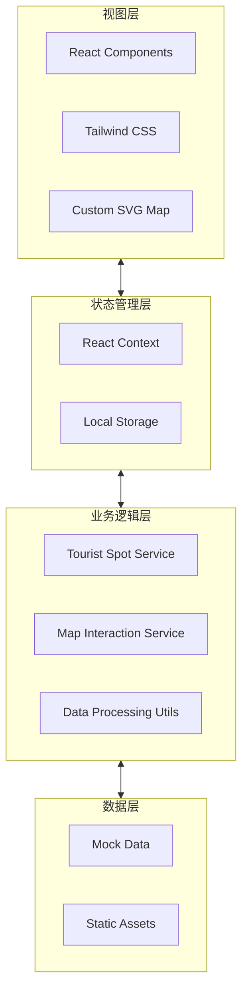
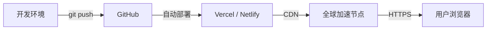

# 宁夏旅游地图网站 - 技术架构文档

## 1. 架构设计概述

本项目采用**单页应用（SPA）架构**，基于 React 18 + TypeScript + Vite 构建高性能前端应用。整体架构分为视图层、状态管理层和业务逻辑层三层结构。

### 1.1 系统架构图



### 1.2 技术栈

| 层级 | 技术选型 | 说明 |
|------|----------|------|
| 框架 | React 18 | 核心框架 |
| 语言 | TypeScript 5 | 类型安全 |
| 构建 | Vite 5 | 快速构建 |
| 样式 | Tailwind CSS 3 | 原子化CSS |
| 路由 | React Router DOM v6 | SPA路由 |
| 地图 | Custom SVG + Leaflet | 交互式地图 |

---

## 2. 项目结构设计

```
ningxia-tourism-map/
├── public/
│   ├── images/              # 静态图片资源
│   │   ├── attractions/    # 景点图片
│   │   └── cities/         # 城市图片
│   └── svg/
│       └── ningxia-map.svg # 宁夏地图矢量图
│
├── src/
│   ├── components/         # React 组件
│   │   ├── common/         # 通用组件
│   │   │   ├── Header.tsx
│   │   │   ├── Footer.tsx
│   │   │   ├── Button.tsx
│   │   │   └── Card.tsx
│   │   ├── map/            # 地图相关组件
│   │   │   ├── NingxiaMap.tsx
│   │   │   ├── MapMarker.tsx
│   │   │   ├── CityRegion.tsx
│   │   │   └── MapControls.tsx
│   │   ├── attraction/     # 景点相关组件
│   │   │   ├── AttractionCard.tsx
│   │   │   ├── AttractionGallery.tsx
│   │   │   └── AttractionInfo.tsx
│   │   └── layout/         # 布局组件
│   │       ├── PageContainer.tsx
│   │       └── Sidebar.tsx
│   │
│   ├── pages/              # 页面组件
│   │   ├── Home.tsx        # 首页（地图）
│   │   ├── AttractionDetail.tsx  # 景点详情
│   │   ├── CityOverview.tsx      # 城市概览
│   │   └── RouteRecommendation.tsx # 路线推荐
│   │
│   ├── services/           # 业务逻辑服务
│   │   ├── attractions.ts  # 景点数据服务
│   │   ├── cities.ts       # 城市数据服务
│   │   └── routes.ts       # 路线数据服务
│   │
│   ├── data/               # 静态数据
│   │   ├── attractions.json  # 景点数据
│   │   ├── cities.json       # 城市数据
│   │   └── routes.json        # 路线数据
│   │
│   ├── types/              # TypeScript 类型定义
│   │   ├── attractions.ts
│   │   ├── cities.ts
│   │   └── index.ts
│   │
│   ├── hooks/              # 自定义 Hooks
│   │   ├── useMapInteraction.ts
│   │   └── useAttraction.ts
│   │
│   ├── styles/             # 全局样式
│   │   └── globals.css     # 全局样式和CSS变量
│   │
│   ├── utils/              # 工具函数
│   │   └── helpers.ts
│   │
│   ├── App.tsx             # 应用根组件
│   ├── main.tsx            # 入口文件
│   └── router.tsx          # 路由配置
│
├── index.html              # HTML 入口
├── package.json            # 依赖配置
├── tsconfig.json           # TypeScript 配置
├── tailwind.config.js      # Tailwind 配置
├── vite.config.ts          # Vite 配置
└── README.md               # 项目说明
```

---

## 3. 路由定义

| 路由路径 | 页面组件 | 功能描述 | 参数 |
|----------|----------|----------|------|
| `/` | Home | 首页交互式地图 | - |
| `/attraction/:id` | AttractionDetail | 景点详情页 | id: 景点唯一标识 |
| `/city/:name` | CityOverview | 城市概览页 | name: 城市拼音名称 |
| `/routes` | RouteRecommendation | 路线推荐页 | - |

### 3.1 路由配置

```typescript
// src/router.tsx
const routes = [
  {
    path: '/',
    component: Home,
    meta: { title: '宁夏旅游地图' }
  },
  {
    path: '/attraction/:id',
    component: AttractionDetail,
    meta: { title: '景点详情' }
  },
  {
    path: '/city/:name',
    component: CityOverview,
    meta: { title: '城市概览' }
  },
  {
    path: '/routes',
    component: RouteRecommendation,
    meta: { title: '路线推荐' }
  }
]
```

---

## 4. 数据模型定义

### 4.1 景点数据结构

```typescript
interface Attraction {
  id: string;                    // 唯一标识
  name: string;                  // 景点名称
  nameEn?: string;               // 英文名称
  city: string;                  // 所属城市
  type: 'nature' | 'history' | 'religion' | 'experience';  // 景点类型
  coordinates: {
    x: number;                   // SVG地图X坐标
    y: number;                   // SVG地图Y坐标
  };
  rating: number;                // 评分 (1-5)
  description: string;           // 简介
  images: string[];              // 图片URL数组
  openingHours: string;          // 开放时间
  ticketPrice: string;           // 门票价格
  bestSeason: string;            // 最佳季节
  transportation: string;        // 交通指南
  highlights: string[];           // 游览亮点
  nearbyAttractions: string[];   // 周边景点ID数组
}
```

### 4.2 城市数据结构

```typescript
interface City {
  id: string;                    // 唯一标识
  name: string;                  // 城市名称
  pinyin: string;                // 拼音名称（用于URL）
  population: string;            // 人口
  area: string;                  // 面积
  nickname: string;              // 别称
  introduction: string;          // 简介
  history: string;               // 历史沿革
  foods: Food[];                 // 代表美食
  bestSeason: string;            // 最佳游览季节
  culture: string;               // 特色文化
  image: string;                 // 城市图片
}
```

### 4.3 路线数据结构

```typescript
interface Route {
  id: string;                    // 唯一标识
  name: string;                  // 路线名称
  theme: string;                 // 主题（如：沙漠探险、文化之旅）
  duration: string;              // 推荐天数
  budget: string;                // 预算参考
  description: string;          // 路线描述
  attractions: string[];         // 包含的景点ID数组
  highlights: string[];          // 路线亮点
}
```

---

## 5. 核心组件设计

### 5.1 交互式地图组件

**N ingxiaMap** 是核心地图组件，负责渲染 SVG 地图和处理交互逻辑。

```typescript
// 组件 Props
interface NingxiaMapProps {
  attractions: Attraction[];           // 景点数据
  selectedCity?: string;                // 选中的城市
  onMarkerClick: (id: string) => void; // 标记点击回调
  onRegionClick: (city: string) => void; // 区域点击回调
  zoomLevel: number;                    // 缩放级别
}
```

**核心功能**:
1. 渲染宁夏行政区划 SVG 地图
2. 在指定坐标位置渲染景点标记
3. 处理缩放和平移交互
4. 高亮显示选中区域
5. 响应式调整标记位置

### 5.2 景点标记组件

```typescript
interface MapMarkerProps {
  attraction: Attraction;
  isSelected: boolean;
  isHovered: boolean;
  onClick: () => void;
  onMouseEnter: () => void;
  onMouseLeave: () => void;
}
```

**交互行为**:
- 默认状态：显示标记图标
- 悬停状态：放大 1.2 倍，显示光晕效果
- 选中状态：持续放大，显示预览卡片
- 点击行为：触发导航到详情页

### 5.3 景点卡片组件

```typescript
interface AttractionCardProps {
  attraction: Attraction;
  variant: 'preview' | 'full';
  onViewDetails: () => void;
}
```

**展示内容**:
- 景点图片
- 景点名称
- 城市标签
- 评分星级
- 简短描述

---

## 6. 状态管理设计

### 6.1 React Context 结构

```typescript
// App Context
interface AppState {
  selectedAttraction: Attraction | null;
  selectedCity: string | null;
  filterType: AttractionType | 'all';
  zoomLevel: number;
}

// App Context Provider
const AppProvider: React.FC<{ children: ReactNode }> = ({ children }) => {
  const [state, setState] = useState<AppState>(initialState);
  
  // 提供状态和更新方法
  return (
    <AppContext.Provider value={{ state, setState }}>
      {children}
    </AppContext.Provider>
  );
};
```

### 6.2 LocalStorage 持久化

- 保存用户浏览历史
- 记录收藏的景点
- 缓存筛选偏好设置

---

## 7. 样式系统设计

### 7.1 Tailwind 配置扩展

```javascript
// tailwind.config.js
module.exports = {
  theme: {
    extend: {
      colors: {
        primary: '#C4A35A',      // 沙金色
        secondary: '#2D5A4A',     // 胡杨绿
        accent: '#E85D4C',       // 枸杞红
        background: '#F5F2EB',   // 暖白色
        'text-primary': '#1A1A1A',
        'text-secondary': '#6B6B6B',
      },
      fontFamily: {
        serif: ['Noto Serif SC', 'serif'],
        sans: ['Noto Sans SC', 'sans-serif'],
        decorative: ['Ma Shan Zheng', 'cursive'],
      },
      animation: {
        'marker-bounce': 'markerBounce 0.6s ease-out',
        'card-slide': 'cardSlide 0.3s ease-out',
        'fade-in': 'fadeIn 0.4s ease-out',
      },
    },
  },
}
```

### 7.2 全局 CSS 变量

```css
:root {
  --color-primary: #C4A35A;
  --color-secondary: #2D5A4A;
  --color-accent: #E85D4C;
  --color-background: #F5F2EB;
  --color-text-primary: #1A1A1A;
  --color-text-secondary: #6B6B6B;
  
  --font-serif: 'Noto Serif SC', serif;
  --font-sans: 'Noto Sans SC', sans-serif;
  --font-decorative: 'Ma Shan Zheng', cursive;
  
  --radius-sm: 4px;
  --radius-md: 8px;
  --radius-lg: 16px;
  
  --shadow-sm: 0 2px 4px rgba(0,0,0,0.1);
  --shadow-md: 0 4px 12px rgba(0,0,0,0.15);
  --shadow-lg: 0 8px 24px rgba(0,0,0,0.2);
}
```

---

## 8. 性能优化策略

### 8.1 图片优化
- 使用 WebP 格式，支持渐进式加载
- 实现懒加载，仅加载视口内图片
- 提供响应式图片 srcset
- 图片压缩和 CDN 加速

### 8.2 代码优化
- 路由级别的代码分割
- 组件懒加载和预加载
- Tree-shaking 去除无用代码
- 按需导入依赖模块

### 8.3 渲染优化
- React.memo 避免不必要的重渲染
- useMemo 和 useCallback 缓存计算结果
- SVG 路径动画使用 CSS transform
- 虚拟列表处理长列表数据

---

## 9. SVG 地图实现方案

### 9.1 地图数据结构

宁夏地图包含5个地级市的行政区划边界路径：

```typescript
interface MapPath {
  id: string;                    // 城市ID
  name: string;                  // 城市名称
  path: string;                  // SVG path d 属性
  labelPosition: { x: number; y: number };  // 标签位置
  markerPositions: { x: number; y: number }[];  // 景点标记位置
}
```

### 9.2 交互实现

```typescript
// 地图交互 Hook
const useMapInteraction = () => {
  const [zoom, setZoom] = useState(1);
  const [pan, setPan] = useState({ x: 0, y: 0 });
  const [selectedRegion, setSelectedRegion] = useState<string | null>(null);
  
  // 处理缩放
  const handleZoom = (delta: number) => {
    setZoom(prev => Math.min(Math.max(prev + delta, 0.5), 3));
  };
  
  // 处理平移
  const handlePan = (dx: number, dy: number) => {
    setPan(prev => ({ x: prev.x + dx, y: prev.y + dy }));
  };
  
  // 处理区域点击
  const handleRegionClick = (cityId: string) => {
    setSelectedRegion(cityId);
  };
  
  return { zoom, pan, selectedRegion, handleZoom, handlePan, handleRegionClick };
};
```

---

## 10. 响应式断点设计

```javascript
// Tailwind 断点配置
const breakpoints = {
  mobile: '0px',      // < 768px
  tablet: '768px',    // 768px - 1199px
  desktop: '1200px',   // ≥ 1200px
};

// 响应式策略
// 移动端：底部弹出面板展示景点信息
// 平板端：侧边栏或弹出层展示
// 桌面端：完整布局，侧边栏展示详情
```

---

## 11. 无障碍设计（a11y）

- 语义化 HTML 结构
- ARIA 标签标注交互元素
- 键盘导航支持
- 颜色对比度符合 WCAG AA 标准
- 屏幕阅读器友好的内容顺序
- focus 状态清晰可见

---

## 12. 部署架构



本项目采用静态部署方式，支持 Vercel、Netlify 等主流静态网站托管平台。
