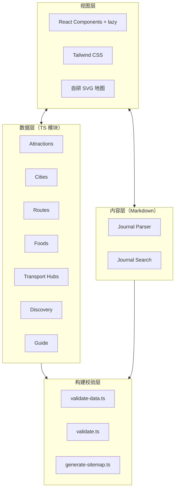

# 宁夏旅游地图网站 - 技术架构文档

## 1. 架构设计概述

本项目采用**单页应用（SPA）架构**，基于 React 18 + TypeScript + Vite 构建高性能静态前端应用。整体架构分为视图层、数据层、内容层和构建校验层。

### 1.1 系统架构图


```mermaid
flowchart TB
    subgraph ViewLayer["视图层"]
        A[React Components + lazy]
        B[Tailwind CSS]
        C[自研 SVG 地图]
    end

    subgraph DataLayer["数据层（TS 模块）"]
        D[Attractions]
        E[Cities]
        F[Routes]
        G[Foods]
        H[Transport Hubs]
        I[Discovery]
        J[Guide]
    end

    subgraph ContentLayer["内容层（Markdown）"]
        K[Journal Parser]
        L[Journal Search]
    end

    subgraph BuildGate["构建校验层"]
        M[validate-data.ts]
        N[validate.ts]
        O[generate-sitemap.ts]
    end

    ViewLayer <--> DataLayer
    ViewLayer <--> ContentLayer
    DataLayer --> BuildGate
    ContentLayer --> BuildGate
```

### 1.2 技术栈

| 层级 | 技术选型 | 版本 | 说明 |
|------|----------|------|------|
| 框架 | React | 18.3 | 核心框架 |
| 语言 | TypeScript | ~5.8 | 类型安全 |
| 构建 | Vite | 6.4 | 快速构建 |
| 样式 | Tailwind CSS | 3.4 | 原子化 CSS |
| 路由 | React Router DOM | 7.18 | SPA 路由 |
| 地图 | 自研 SVG + GeoJSON | — | 交互式地图，不依赖 Leaflet |
| Markdown | react-markdown + remark-gfm | 10.1 / 4.0 | 手记内容渲染 |
| 图标 | lucide-react | 0.511 | UI 图标 |
| 工具 | clsx + tailwind-merge | 2.1 / 3.6 | 样式合并 |
| 测试 | Vitest + Playwright | 3.2 / 1.55 | 单元测试 + E2E |
| 图片处理 | sharp | 0.35 | 多格式图片生成 |
| 性能审计 | Lighthouse + chrome-launcher | 13.4 | 移动端性能门禁 |
| YAML 解析 | yaml | 2.8 | 手记 Frontmatter |

---

## 2. 项目结构设计

```
ningxia-tourism-map/
├── public/
│   ├── data/
│   │   ├── ningxia-province.json      # 省级边界 GeoJSON
│   │   └── ningxia/districts/         # 五市地级区县边界
│   │       ├── yinchuan.json
│   │       ├── shizuishan.json
│   │       ├── wuzhong.json
│   │       ├── guyuan.json
│   │       └── zhongwei.json
│   ├── images/
│   │   ├── attractions/              # 景点图片（webp + avif 多尺寸）
│   │   └── journal/editorial/        # 专题插画
│   ├── 404.html                     # GitHub Pages SPA 回退
│   ├── favicon.svg
│   ├── og.jpg
│   └── robots.txt
│
├── src/
│   ├── components/
│   │   ├── map/                     # 地图模块（独立图层）
│   │   │   ├── config.ts            # 地图配置、政府标记、键盘工具
│   │   │   ├── projection.ts         # WGS84 → SVG 投影
│   │   │   ├── projection.test.ts
│   │   │   ├── useMapViewport.ts     # 缩放/平移 Hook
│   │   │   ├── MapRegionLayer.tsx    # 行政区域图层
│   │   │   ├── AttractionLayer.tsx   # 景点图层（role=button）
│   │   │   ├── FoodLayer.tsx         # 美食图层（role=button）
│   │   │   ├── TransportLayer.tsx   # 交通枢纽图层（role=img）
│   │   │   ├── GovernmentLayer.tsx   # 政府标记图层（role=img）
│   │   │   ├── MapControls.tsx       # 图层开关控件
│   │   │   └── MapPreview.tsx       # 景点/美食预览卡片
│   │   ├── ErrorBoundary.tsx
│   │   ├── Footer.tsx
│   │   ├── Header.tsx
│   │   ├── Loading.tsx
│   │   ├── NingxiaInteractiveMap.tsx # 地图根组件
│   │   ├── ResponsiveImage.tsx       # 响应式图片（webp/avif）
│   │   ├── SEO.tsx                   # SEO meta 组件
│   │   └── SEO.test.tsx
│   │
│   ├── content/
│   │   ├── journal/                 # 手记 Markdown 源文件
│   │   ├── journal-parser.ts        # 构建时解析 Markdown + Frontmatter
│   │   ├── journal-search.ts        # 手记搜索索引
│   │   ├── journal.ts               # 手记数据服务
│   │   ├── journal.test.ts
│   │   └── journal-search.test.ts
│   │
│   ├── data/                        # 数据唯一源（TS 模块，非 JSON）
│   │   ├── attractions.ts           # 22 published + 1 draft
│   │   ├── cities.ts                # 5 个地级市
│   │   ├── routes.ts                # 9 条路线
│   │   ├── foods.ts                 # 14 道美食
│   │   ├── transport.ts             # 8 个交通枢纽
│   │   ├── discovery.ts             # 4 组旅行兴趣组合
│   │   ├── guide.ts                 # 行前指南
│   │   ├── meta.ts                  # 站点元信息
│   │   ├── validate.ts              # 数据校验逻辑
│   │   ├── validate.test.ts
│   │   └── guide.test.ts
│   │
│   ├── lib/                         # 工具函数
│   │   ├── route.ts                 # 路由辅助
│   │   ├── route.test.ts
│   │   ├── site.ts                  # 站点配置
│   │   ├── site.test.ts
│   │   ├── useSearchParamsFilter.ts  # URL 筛选 Hook
│   │   ├── useShare.tsx             # 分享 Hook
│   │   └── utils.ts
│   │
│   ├── pages/                       # 页面组件（lazy 加载）
│   │   ├── Home.tsx                 # 首页（交互式地图 + 路线匹配）
│   │   ├── AttractionDetail.tsx     # 景点详情
│   │   ├── AttractionsList.tsx      # 景点列表
│   │   ├── FoodDetail.tsx           # 美食详情
│   │   ├── FoodsList.tsx            # 美食列表
│   │   ├── CityOverview.tsx         # 城市概览
│   │   ├── RouteRecommendation.tsx  # 路线推荐
│   │   ├── RouteDetail.tsx           # 路线详情
│   │   ├── Journal.tsx              # 手记列表
│   │   ├── JournalDetail.tsx        # 手记详情
│   │   ├── TravelGuide.tsx         # 行前指南
│   │   ├── About.tsx               # 关于
│   │   ├── NotFound.tsx            # 404
│   │   ├── GeoJSONViewer.tsx       # 开发查看器（DEV only）
│   │   └── GeoJSONEditor.tsx       # 开发编辑器（DEV only）
│   │
│   ├── test/
│   │   └── setup.ts                # Vitest 测试配置
│   │
│   ├── types/
│   │   ├── index.ts                # 全局类型定义
│   │   └── geojson.d.ts            # GeoJSON 类型声明
│   │
│   ├── App.tsx                     # 应用根组件 + 路由配置
│   ├── index.css                   # 全局样式 + CSS 变量
│   ├── main.tsx                    # 入口文件
│   └── vite-env.d.ts
│
├── scripts/                         # 构建脚本
│   ├── validate-data.ts            # 数据完整性 + 反糟粕门禁
│   ├── generate-sitemap.ts        # sitemap 生成
│   ├── process-images.ts          # 图片格式转换
│   ├── run-lighthouse.ts           # Lighthouse 性能门禁
│   ├── load-journal-files.ts       # 手记文件加载
│   └── converted-cities.ts         # 城市数据转换
│
├── tests/
│   └── e2e/
│       └── tourism.spec.ts         # Playwright E2E 测试
│
├── docs/                            # 文档与模板
│   ├── CONTENT_AUDIT.md            # 内容审计记录
│   ├── IMAGE_PROVENANCE.md         # 图片来源记录
│   ├── MAINTENANCE.md             # 内容维护说明
│   ├── templates/                  # 手记/探店模板
│   └── attraction-template.json
│
├── .github/workflows/deploy.yml    # GitHub Actions 部署
├── index.html
├── package.json
├── tsconfig.json
├── tailwind.config.js
├── vite.config.ts
├── playwright.config.ts
└── eslint.config.js
```

---

## 3. 路由定义

路由配置位于 `src/App.tsx`，所有页面组件通过 `React.lazy` 懒加载。

| 路由路径 | 页面组件 | 功能描述 | 参数 |
|----------|----------|----------|------|
| `/` | Home | 首页：交互式地图 + 路线匹配 + 最近专题 | — |
| `/attractions` | AttractionsList | 景点列表，支持城市/类型/兴趣筛选 | — |
| `/attraction/:id` | AttractionDetail | 景点详情页 | id: 景点唯一标识 |
| `/foods` | FoodsList | 美食列表 | — |
| `/food/:id` | FoodDetail | 美食详情页 | id: 美食唯一标识 |
| `/cities` | CityOverview | 五城概览 | — |
| `/city/:name` | CityOverview | 单城市详情 | name: 城市拼音 |
| `/routes` | RouteRecommendation | 路线推荐，支持 1—5 天筛选 | — |
| `/routes/:routeId` | RouteDetail | 路线详情 | routeId: 路线 ID |
| `/journal` | Journal | 手记列表，支持搜索与筛选 | — |
| `/journal/:type/:slug` | JournalDetail | 手记详情 | type: travel/food/guide, slug |
| `/guide` | TravelGuide | 行前指南 | — |
| `/about` | About | 关于页面 | — |
| `/dev/geojson` | GeoJSONViewer | GeoJSON 查看器（仅开发环境） | — |
| `/dev/editor` | GeoJSONEditor | GeoJSON 编辑器（仅开发环境） | — |

### 3.1 路由配置

```typescript
// src/App.tsx（节选）
const Home = lazy(() => import('./pages/Home'));
const AttractionDetail = lazy(() => import('./pages/AttractionDetail'));
const FoodDetail = lazy(() => import('./pages/FoodDetail'));
// ... 其余 lazy 导入

function AppRoutes() {
  return (
    <div className="site-frame">
      <Header />
      <main className="site-main" id="main-content">
        <Suspense fallback={<Loading />}>
          <Routes>
            <Route path="/" element={<Home />} />
            <Route path="/attractions" element={<AttractionsList />} />
            <Route path="/attraction/:id" element={<AttractionDetail />} />
            <Route path="/foods" element={<FoodsList />} />
            <Route path="/food/:id" element={<FoodDetail />} />
            <Route path="/cities" element={<CityOverview />} />
            <Route path="/city/:name" element={<CityOverview />} />
            <Route path="/routes" element={<RouteRecommendation />} />
            <Route path="/routes/:routeId" element={<RouteDetail />} />
            <Route path="/journal" element={<Journal />} />
            <Route path="/journal/:type/:slug" element={<JournalDetail />} />
            <Route path="/guide" element={<TravelGuide />} />
            <Route path="/about" element={<About />} />
            {GeoJSONViewer && <Route path="/dev/geojson" element={<GeoJSONViewer />} />}
            {GeoJSONEditor && <Route path="/dev/editor" element={<GeoJSONEditor />} />}
            <Route path="*" element={<NotFound />} />
          </Routes>
        </Suspense>
      </main>
      <Footer />
    </div>
  );
}
```

---

## 4. 数据模型定义

类型定义位于 `src/types/index.ts`，所有联合类型禁止以 `| string` 放宽。

### 4.1 景点数据结构

```typescript
export interface Attraction {
  id: string;                        // kebab-case ASCII
  status: 'published' | 'draft';    // published 进入公开页面
  verificationLevel: 'verified' | 'review';
  name: string;
  cityId: CityId;                    // 五个固定城市 ID
  locality: string;                  // 县区
  category: 'nature' | 'history' | 'religion' | 'experience';
  coordinates: { lng: number; lat: number };  // WGS84
  summary: string;
  highlights: string[];
  visitInfo: {
    openingHours: string;
    ticketPrice: string;
    reservation: string;
    duration: string;
    bestSeason: string;
    transportation: string;
    address: string;
  };
  images: AttractionImage[];        // 含 credit、license、sourceUrl
  nearbyIds: string[];               // 周边景点 ID
  sources: SourceRef[];              // 可核实来源
  verifiedAt: string;               // YYYY-MM-DD
  verificationNote: string;
  fallbackNote?: string;             // 待复核景点的替代方案
}
```

### 4.2 城市数据结构

```typescript
export interface City {
  id: CityId;
  name: string;
  pinyin: CityId;
  travelRole: string;               // 旅行角色定位
  connectionNote: string;           // 交通衔接说明
  suggestedStay: string;            // 建议停留
  arrivalNote: string;              // 抵达方式
  bestFor: string[];                // 适合人群
  planningTip: string;             // 行程提醒
  nickname: string;
  introduction: string;
  history: string;
  foods: string[];                  // 美食 ID 引用
  bestSeason: string;
  culture: string;
  image: AttractionImage;
}
```

### 4.3 路线数据结构

```typescript
export interface RoutePlan {
  id: string;
  name: string;
  theme: 'first-visit' | 'weekend' | 'panorama' | 'culture' | 'food';
  themeLabel: string;
  durationDays: number;
  durationLabel: string;
  audience: string;
  budget: string;
  bestSeason: string;
  pace: 'relaxed' | 'balanced' | 'intensive';
  walkingLevel: 'low' | 'medium' | 'high';
  transportSummary: string;
  summary: string;
  highlights: string[];
  days: RouteDay[];                 // 逐日行程
  verifiedAt: string;
}

export interface RouteDay {
  day: number;
  title: string;
  summary: string;
  stops: RouteStop[];               // 停靠点（含 attractionId 或 mapQuery）
  meals: string[];
  accommodation: string;
  timeSlots?: RouteTimeSlot[];      // 逐日时间槽
}
```

### 4.4 美食数据结构

```typescript
export interface Food {
  id: string;
  status: 'published' | 'draft';
  verificationLevel: 'verified' | 'review';
  name: string;
  category: 'mutton' | 'noodle' | 'snack' | 'drink' | 'fruit' | 'specialty' | 'staple';
  description: string;
  origin: string;
  bestSeason?: string;
  priceRange?: string;
  restaurants: Restaurant[];        // 餐厅不含 phone 字段
  tips?: string;
  sources: SourceRef[];
  verifiedAt: string;
}

export interface Restaurant {
  name: string;
  cityId: CityId;
  coordinates?: Coordinates;
  recommend?: string;
  // 注意：不含 phone 字段，运营信息由探店手记承载
}
```

### 4.5 交通枢纽数据结构

```typescript
export interface TransportHub {
  id: string;
  name: string;
  cityId: CityId;
  type: 'highspeed_rail' | 'railway' | 'bus' | 'airport';
  coordinates: Coordinates;
  description?: string;
  address?: string;
  phone?: string;                   // 仅有可核实来源时保留
  sources?: SourceRef[];
  verifiedAt: string;               // 必填，180 天有效期
}
```

### 4.6 手记数据结构

手记分为三种类型，共享公共字段，各有专有字段：

```typescript
export type JournalType = 'travel' | 'food' | 'guide';
export type JournalContentKind = 'firsthand' | 'editorial' | 'demo';

// 公共字段
export interface JournalCommon {
  slug: string;
  type: JournalType;
  status: ContentStatus;
  contentKind: JournalContentKind;
  featured: boolean;
  title: string;
  excerpt: string;
  author: string;
  publishedAt: string;
  updatedAt: string;
  cityId: CityId;
  locality: string;
  tags: string[];
  cover: AttractionImage;
  gallery: AttractionImage[];
  relatedAttractionIds: string[];
  relatedRouteIds: string[];
  body: string;                     // Markdown 正文
}

// 亲历游记
export interface TravelJournal extends JournalCommon {
  type: 'travel';
  tripDate: string;
  duration: string;
  transport: string;
  budgetNote: string;
  highlights: string[];
}

// 探店手记
export interface FoodJournal extends JournalCommon {
  type: 'food';
  visitedAt: string;
  venueName: string;
  cuisine: string;
  address: string;
  mapQuery: string;
  pricePerPerson: string;
  dishes: string[];
  queueNote: string;
  suitableFor: string;
  revisitNote: string;
}

// 资料专题
export interface EditorialJournal extends JournalCommon {
  type: 'guide';
  reviewedAt: string;
  scopeNote: string;
  keyPoints: string[];
  references: JournalReference[];
}
```

### 4.7 来源引用结构

```typescript
export interface SourceRef {
  label: string;
  url: string;
  kind: 'official' | 'image';
  level: 'direct' | 'directory' | 'homepage';
  coverage: ('overview' | 'visit' | 'location')[];
  checkedAt: string;                 // YYYY-MM-DD
}
```

### 4.8 政府标记

政府标记定义在 `src/components/map/config.ts`，不在 `src/data/` 中维护：

```typescript
export interface GovernmentMarker {
  id: string;
  name: string;
  level: 'province-capital' | 'city-capital';
  cityId?: CityId;
  coordinates: Coordinates;
  sources: SourceRef[];
  verifiedAt: string;               // 必填，180 天有效期
}
```

---

## 5. 核心组件设计

### 5.1 交互式地图系统

地图根组件 `NingxiaInteractiveMap` 负责渲染 SVG 地图和协调各图层。

**架构组成**：

| 模块 | 文件 | 职责 |
|------|------|------|
| 投影 | `projection.ts` | WGS84 经纬度 → SVG 坐标，GeoJSON 边界解析 |
| 视口控制 | `useMapViewport.ts` | 缩放（1—2.4 倍）、平移（±180px）、指针拖拽 |
| 区域图层 | `MapRegionLayer.tsx` | 五市行政区域渲染与高亮 |
| 景点图层 | `AttractionLayer.tsx` | 景点标记，`role="button"`，支持键盘激活 |
| 美食图层 | `FoodLayer.tsx` | 美食标记，`role="button"`，点击跳转详情 |
| 交通图层 | `TransportLayer.tsx` | 交通枢纽，`role="img"`，机场使用飞机图标 |
| 政府图层 | `GovernmentLayer.tsx` | 政府标记，`role="img"`，仅导航锚点 |
| 控件 | `MapControls.tsx` | 图层开关，`aria-pressed` 标记激活 |
| 预览 | `MapPreview.tsx` | 景点/美食悬浮卡片 |

### 5.2 地图视口 Hook

```typescript
// src/components/map/useMapViewport.ts
export default function useMapViewport() {
  const [zoom, setZoom] = useState(1);
  const [pan, setPan] = useState({ x: 0, y: 0 });

  const zoomIn = useCallback(() => setZoom(v => Math.min(2.4, v + 0.25)), []);
  const zoomOut = useCallback(() => setZoom(v => Math.max(1, v - 0.25)), []);

  // Pointer Events 实现拖拽平移
  const onPointerDown = (event: PointerEvent<SVGSVGElement>) => { ... };
  const onPointerMove = (event: PointerEvent<SVGSVGElement>) => { ... };

  return { zoom, pan, zoomIn, zoomOut, resetViewport, viewportHandlers };
}
```

### 5.3 地图投影

```typescript
// src/components/map/projection.ts
export interface GeoFeature {
  type: 'Feature';
  properties: { name?: string; fullname?: string; code?: string; pinyin?: string; };
  geometry: { type: 'Polygon' | 'MultiPolygon'; coordinates: ... };
}

// WGS84 经纬度 → SVG 像素坐标
export function project(lng: number, lat: number, bounds: GeoBounds, view: { width: number; height: number }) { ... }
```

---

## 6. 样式系统设计

### 6.1 Tailwind 配置

```javascript
// tailwind.config.js（节选）
export default {
  darkMode: "class",
  content: ["./index.html", "./src/**/*.{js,ts,jsx,tsx}"],
  theme: {
    extend: {
      colors: {
        primary: '#C4A35A',          // 沙金色
        secondary: '#2D5A4A',        // 胡杨绿
        accent: '#E85D4C',           // 枸杞红
        background: '#F5F2EB',        // 暖白色
        'text-primary': '#1A1A1A',
        'text-secondary': '#6B6B6B',
        'sand-light': '#E8DCC8',
        'sand-dark': '#B89B5D',
        'oasis': '#3D6B5A',
        'desert': '#D4A857',
      },
      fontFamily: {
        serif: ['Noto Serif SC', 'serif'],
        sans: ['Noto Sans SC', 'sans-serif'],
        decorative: ['Ma Shan Zheng', 'cursive'],
      },
      animation: {
        'marker-bounce': 'markerBounce 0.6s ease-out',
        'card-slide': 'cardSlide 0.3s ease-out',
        'fade-in': 'fadeIn 0.4s ease-out',
        'slide-up': 'slideUp 0.5s ease-out',
        'scale-in': 'scaleIn 0.3s ease-out',
        'pulse-glow': 'pulseGlow 2s ease-in-out infinite',
      },
      boxShadow: {
        'soft': '0 2px 8px rgba(0, 0, 0, 0.08)',
        'medium': '0 4px 16px rgba(0, 0, 0, 0.12)',
        'large': '0 8px 32px rgba(0, 0, 0, 0.16)',
        'glow': '0 0 20px rgba(196, 163, 90, 0.4)',
      },
    },
  },
}
```

### 6.2 全局 CSS

全局样式和 CSS 变量定义在 `src/index.css`，通过 Tailwind 指令引入。

---

## 7. 数据校验系统

### 7.1 构建期门禁

`npm run validate:data` 执行 `scripts/validate-data.ts` 和 `src/data/validate.ts`，覆盖以下校验：

| 门禁 | 检测内容 | 位置 |
|------|----------|------|
| 重复 JSON 双写 | `src/data/` 与 `public/data/` 不允许同名 JSON | `scripts/validate-data.ts` |
| 模板化电话 | 拒绝 `0951-12306` 等模板填充电话 | `src/data/validate.ts` |
| 类型安全削弱 | `export type` 联合类型禁止 `| string` | `scripts/validate-data.ts` |
| 异常 ID | 所有 `id` 必须符合 kebab-case ASCII | `src/data/validate.ts` |
| 电话区号匹配 | 交通枢纽电话区号必须与所在城市一致 | `src/data/validate.ts` |
| verifiedAt 过期 | 超过 180 天未复核的条目阻断构建 | `src/data/validate.ts` |
| 占位文本 | 拒绝"示例""演示用""待填写"等占位内容 | `src/data/validate.ts` |
| 跨数据引用 | 路线停靠点只能引用已发布景点 | `src/data/validate.ts` |
| 图片完整性 | 已发布景点和手记的图片必须有本地多格式文件 | `scripts/validate-data.ts` |

### 7.2 verifiedAt 时效性

- 格式：`YYYY-MM-DD`
- 不能晚于当前日期
- 有效期：**180 天**（`VERIFICATION_STALE_DAYS`），超期阻断构建
- 适用于：`Attraction`、`Food`、`TransportHub`、`RoutePlan`、`GovernmentMarker`

---

## 8. 性能优化策略

### 8.1 图片优化
- WebP + AVIF 双格式，720 和 1440 两档
- 响应式图片组件 `ResponsiveImage`，按视口加载合适尺寸
- 构建期校验图片文件完整性

### 8.2 代码优化
- 路由级别 `React.lazy` 代码分割
- 地图图层组件全部使用 `React.memo`
- 父组件回调使用 `useCallback`，计算数组使用 `useMemo`
- 投影函数 `project` 使用 `useMemo` 缓存

### 8.3 构建优化
- 数据以 TypeScript 模块维护，不引入 JSON 解析运行时
- 手记 Markdown 在构建时解析，不发送解析器给访客
- sitemap 在构建时生成

---

## 9. SVG 地图实现方案

### 9.1 地图数据

正式地图边界数据位于：
- `public/data/ningxia-province.json`：省级边界
- `public/data/ningxia/districts/*.json`：五市地级区县边界

首页地图和开发查看器（`/dev/geojson`）共同读取同一套数据。

### 9.2 投影实现

```typescript
// src/components/map/projection.ts
// WGS84 经纬度 → SVG 像素坐标
export function project(
  lng: number,
  lat: number,
  bounds: GeoBounds,
  view: { width: number; height: number }
): { x: number; y: number }
```

### 9.3 地图配置

```typescript
// src/components/map/config.ts
export const mapView = { width: 720, height: 920 } as const;

export const cityColors: Record<CityId, string> = {
  yinchuan: '#c89d4d',
  shizuishan: '#6f9b7d',
  wuzhong: '#d17c58',
  guyuan: '#718b69',
  zhongwei: '#b98656',
};

// 政府标记（6 个：1 个省级 + 5 个市级）
export const governmentMarkers: GovernmentMarker[] = [ ... ];

// 键盘激活工具
export const activateWithKeyboard = (event, action) => {
  if (event.key !== 'Enter' && event.key !== ' ') return;
  event.preventDefault();
  action();
};
```

---

## 10. 响应式断点设计

```javascript
// Tailwind 默认断点
// 移动端：< 768px
// 平板端：768px - 1199px
// 桌面端：≥ 1200px

// 响应式策略
// 移动端：底部弹出面板展示景点信息，汉堡菜单，兴趣卡横向滑动
// 平板端：弹出层展示，导航栏完整
// 桌面端：完整布局，侧边栏展示详情
```

---

## 11. 无障碍设计（a11y）

### 地图图层无障碍

- **可交互图层**（景点、美食）：`role="button"` + `onKeyDown`（Enter/Space 激活，通过 `activateWithKeyboard`）
- **纯展示图层**（政府标记、交通枢纽）：`role="img"` + `tabIndex={0}` + 可读 `aria-label`
- 图层开关使用 `aria-pressed` 标记激活状态

### 通用无障碍

- 语义化 HTML 结构
- 跳转链接 `skip-link`
- 路由切换公告 `aria-live="polite"`
- 键盘导航支持
- 颜色对比度符合 WCAG AA 标准

---

## 12. 测试体系

### 12.1 单元测试（Vitest）

| 测试文件 | 覆盖范围 |
|----------|----------|
| `src/data/validate.test.ts` | 数据校验逻辑（ID、电话、verifiedAt 过期等） |
| `src/data/guide.test.ts` | 行前指南数据 |
| `src/content/journal.test.ts` | 手记解析 |
| `src/content/journal-search.test.ts` | 手记搜索 |
| `src/components/map/projection.test.ts` | 地图投影 |
| `src/components/SEO.test.tsx` | SEO 组件 |
| `src/lib/route.test.ts` | 路由辅助 |
| `src/lib/site.test.ts` | 站点配置 |

### 12.2 端到端测试（Playwright）

- 位于 `tests/e2e/tourism.spec.ts`
- 覆盖地图交互、图层切换、键盘无障碍、路线筛选、美食详情等场景
- 桌面端和移动端两个 viewport 均需通过

---

## 13. 部署架构


```mermaid
flowchart LR
    A[开发环境] -->|git push| B[GitHub]
    B -->|GitHub Actions| C[构建 + 校验]
    C -->|通过| D[GitHub Pages]
    D -->|HTTPS| E[用户浏览器]
```

### GitHub Actions 流水线

`.github/workflows/deploy.yml` 依次执行：

1. 依赖安装与安全审计（`npm audit`）
2. 数据校验（`npm run validate:data`）
3. TypeScript 类型检查（`npm run check`）
4. ESLint 代码检查（`npm run lint`）
5. 单元测试（`npm test`）
6. 端到端测试（`npm run test:e2e`）
7. 生产构建 + sitemap 生成（`npm run build`）
8. 移动端 Lighthouse 性能门禁（`npm run quality:lighthouse`）

`public/404.html` 为 GitHub Pages 提供 SPA 深层链接回退。
