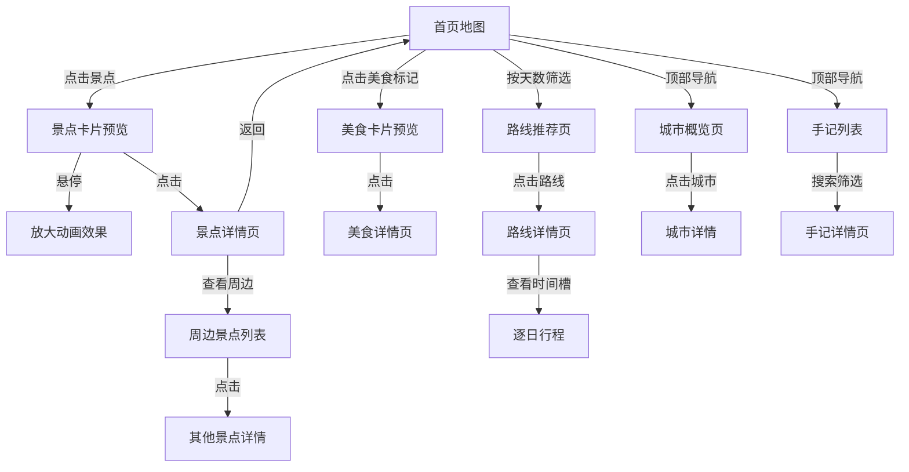

# 宁夏旅游地图网站 - 产品需求文档

> v0.3.81 发布补充（2026-09-02）：首页旅行专题卡片使用纵向弹性布局，让不同长度内容共享统一的“阅读全文”入口位置；与景点、美食、推荐路线卡片使用同一节奏规则，不改变中屏组合卡片或移动端单列布局。

> 当前实现快照已更新至 v0.3.81：首页旅行专题卡片与景点、美食、推荐路线卡片均使用纵向弹性布局，桌面端行动入口保持底部对齐；中屏保留末张专题卡片横向组合，移动端保持单列布局；其余视觉、触控热区和内容核验基线不变。

> v0.3.80 发布补充（2026-09-02）：景点与美食卡片使用纵向弹性布局，让不同长度内容共享统一的底部行动入口位置；与推荐路线卡片使用同一节奏规则，不改变卡片交互或移动端布局。

> v0.3.79 发布补充（2026-09-02）：推荐路线卡片使用纵向弹性布局，让不同长度内容共享统一的底部行动入口位置；不改变路线内容、操作行为或移动端单列布局。

> v0.3.78 发布补充（2026-09-02）：路线卡片核实概览与景点详情多图选择器补充带名称的语义分组；不改变卡片视觉、图片切换或路线数据。

> v0.3.77 发布补充（2026-09-02）：首页山河主题图形补充图像语义，行前清单进度使用标准进度条语义并实时暴露已完成数量与总数；不改变页面视觉层级或清单本地存储行为。

> v0.3.76 发布补充（2026-09-02）：五城概览的城市卡片图片在 320/390px 下按卡片宽度自适应并保持 16:9 比例，避免被最小高度与宽高比叠加撑出卡片；不改变城市内容或桌面端布局。

> v0.3.75 发布补充（2026-09-02）：地图层级面包屑与地图控制区补充独立分组语义，区县颜色图例按钮使用与可操作行为一致的指针反馈；不改变地图布局、图层行为或数据。

> v0.3.74 发布补充（2026-09-02）：路线筛选按行程天数、涉及城市、旅行主题和行程节奏划分为四个可识别分组，为辅助技术提供独立名称；区县颜色图例改为可聚焦操作入口，键盘焦点与鼠标悬停均可联动地图高亮；不改变筛选布局、地址参数或地图数据。

> v0.3.73 发布补充（2026-09-02）：地图懒加载未触发时使用与正式地图一致的沙纸渐变、点状纹理和抽象宁夏轮廓，并保留明确的 `role="status"` 加载提示；不改变地图数据、进入视口后的加载时机或交互行为。

> v0.3.72 发布补充（2026-09-02）：地图景点点位透明触控热区统一为至少 44px 的实际屏幕尺寸，并与美食点位保持一致；相邻点位由地图画布按最近距离分发点击，不改变点位视觉大小、详情预览或键盘交互行为。

> v0.3.71 发布补充（2026-09-02）：桌面端路径切换后将键盘焦点交给新的主要内容区域，避免焦点停留在旧页面导航；移动端菜单跳转继续将焦点回收到菜单按钮，不改变菜单收起、Escape、遮罩关闭与滚动锁定行为。

> 当前实现快照已更新至 v0.3.80：景点、美食与推荐路线卡片均使用纵向弹性布局，行动入口在桌面端保持底部对齐；路线卡片核实概览与景点详情多图选择器补充带名称的语义分组；首页山河主题图形与行前清单进度补充标准可访问语义；五城概览的城市卡片图片在窄屏按卡片宽度自适应并保持 16:9 比例；地图层级面包屑与地图控制区拥有独立分组语义，路线筛选四组条件拥有独立语义名称；地图懒加载占位与正式画布共享沙纸色、纹理和抽象轮廓；桌面端路径变化后焦点进入唯一的 `main#main-content`，移动端菜单跳转保留菜单按钮焦点；其余视觉、触控热区和内容核验基线不变。

> v0.3.70 发布补充（2026-09-02）：地图美食图层中的可交互点位补齐透明触控热区，并沿用景点点位的胡杨绿键盘聚焦反馈；不改变红色点位外观或美食详情跳转行为。

> v0.3.69 发布补充（2026-09-02）：移动端点击菜单内容入口后立即收起悬浮面板，并将焦点回收到菜单按钮再完成路由切换，避免旧菜单短暂遮挡新页面；Escape、遮罩关闭、焦点循环和滚动锁定保持不变。

> v0.3.68 发布补充（2026-09-02）：美食详情页使用独立的浅色操作区样式，避免路线详情深色头图按钮规则串入；“分享美食”恢复正文色与高对比背景，不改变分享行为。

> v0.3.67 发布补充（2026-09-02）：路线详情深色头图中的打印、分享与收藏操作统一使用半透明按钮层级；收藏状态与键盘聚焦反馈保持清晰，不改变收藏逻辑。

> v0.3.66 发布补充（2026-09-02）：关于页的内容审计入口指向仓库内实际存在的 `docs/content/CONTENT_AUDIT.md`，确保来源与复核记录可继续访问。

> v0.3.65 发布补充（2026-09-02）：旅行手记栏目标签在 320px 等窄屏下可横向浏览，避免“旅行专题”入口被裁切；保留当前栏目选中态、圆角视觉和键盘切换行为。

> v0.3.64 发布补充（2026-09-02）：五城与路线比较表的“查看”操作入口统一保持至少 44×44px；文字与箭头居中，表格信息密度和移动端横向滚动行为不变。

> v0.3.63 发布补充（2026-09-02）：路线详情时间线中的停靠点名称链接统一保持至少 44px 触控高度；不改变时间线结构、核实标签和原有文字反馈，只补齐名称入口垂直可点击空间。

> v0.3.62 发布补充（2026-09-02）：城市比较表与路线比较表的名称链接统一保持至少 44px 触控高度；横向滚动和表格信息密度不变，仅补齐名称入口的垂直可点击空间。

> v0.3.61 发布补充（2026-09-02）：景点、美食与首页旅行专题卡片的标题链接统一保持至少 44px 触控高度；在不改变卡片层级和主题色的前提下，标题入口拥有一致的垂直留白与键盘聚焦空间。

> v0.3.60 发布补充（2026-09-02）：页脚“继续探索”沿用顶部导航的路径匹配规则，当前栏目统一显示选中态并暴露 `aria-current="page"`；桌面导航、移动菜单与页脚的当前页面反馈保持一致。

> v0.3.59 发布补充（2026-09-02）：顶部桌面导航、移动菜单与页脚“继续探索”共用六类内容入口配置；产品入口名称和路径保持跨端一致，资料说明继续单独分组。

> v0.3.58 发布补充（2026-09-02）：页脚“继续探索”与顶部导航保持景点、美食、路线、指南、手记和五城六类内容入口一致；页脚将内容入口与资料说明分别组织为可识别的导航区域，降低遗漏入口并改善辅助技术浏览。

> v0.3.57 发布补充（2026-09-02）：五城比较表在移动端继续支持容器内横向查看，但不得把整页撑宽；320px 页面根宽度需与视口一致，比较数据仍可通过表格容器滚动访问。

> v0.3.56 发布补充（2026-09-02）：移动端展开菜单的未选中项补齐与桌面导航一致的白底、胡杨绿文字与轻量阴影反馈；菜单入场、遮罩、焦点循环、滚动锁定和当前页语义保持不变。

> v0.3.55 发布补充（2026-09-02）：在 320px 等极窄屏宽度下，站点品牌主名保持单行，360px 以下仅隐藏重复副标题；品牌链接仍暴露完整的“塞上江南宁夏旅行地图”无障碍名称，并确保搜索、收藏、菜单入口不被挤压。

> v0.3.54 发布补充（2026-09-02）：收藏页在 768px 以下使用 76px 底部内边距收口英雄区，避免遗留的 300px 空白将收藏景点与路线推离首屏；桌面端继续遵循 compact hero 的原有节奏。

> v0.3.53 发布补充（2026-09-02）：收藏反馈、PWA 更新提示和景点对比停靠条统一预留 `env(safe-area-inset-bottom, 0px)` 底部手势安全区；桌面端保持原有间距，移动端保留原有层级与触控热区。

> v0.3.52 发布补充（2026-09-02）：路由懒加载期间使用与站点品牌标志一致的地图印章加载态，统一等待阶段的色彩、圆角、阴影与动效语言，并为状态提供可访问名称；动画继续兼容 reduced-motion。

> v0.3.51 发布补充（2026-09-02）：地图景点预览在桌面端与移动端统一使用轻量入场动效；移动端继续以带把手的固定底部面板呈现，并保留安全区、Escape 关闭、焦点回收和 reduced-motion 兼容。

> v0.3.50 发布补充（2026-09-02）：移动端景点预览以固定底部面板呈现，增加可见把手和轻量上滑入场动效；继续保留安全区、Escape 关闭、关闭后回收焦点与实用信息入口。

> v0.3.49 发布补充（2026-09-02）：移动端导航使用实色纸张悬浮面板，并在菜单外增加轻量遮罩与背景虚化，避免底层内容透出；点击遮罩、关闭按钮、Escape 或路由切换均可关闭菜单，背景滚动锁定与焦点循环保持不变。

> v0.3.48 发布补充（2026-09-02）：移动端导航以悬浮面板打开，不推移当前页面内容；打开时锁定背景滚动，关闭、Escape 和路由切换后恢复滚动，并保留菜单焦点循环、当前页标记与点击外部关闭。

> v0.3.47 发布补充（2026-09-02）：路线详情的站点头部、按天导航、日程锚点与 DAY 标记共享响应式吸顶安全区；在桌面端、移动端及 375—480px 手机宽度直接打开或点击 `#route-day-N` 时，目标日程标题不被顶部层遮挡。

> v0.3.46 发布补充（2026-09-02）：路线详情支持直接访问 `#route-day-N` 日程深链接，内容加载后会定位到对应天数并保留 sticky 导航间距。v0.3.45 的搜索与筛选参数在同一路径内变化时，页面状态播报会重新触发；筛选仍保留当前滚动位置。

> v0.3.43 发布补充（2026-09-02）：搜索页、收藏页和开发地图查看器统一使用应用外壳提供的唯一主内容区域，避免嵌套页面地标；搜索与收藏页面加入结构回归。

> v0.3.42 发布补充（2026-09-02）：内容页移动端首图统一为 4:3 视觉框，减少竖幅素材造成的首屏高度波动；图片来源和替代文本规则不变。

> v0.3.41 发布补充（2026-09-02）：GitHub Pages 已统一使用 GitHub Actions 发布，并纳入 SPA 深层链接回退产物校验。

> 当前实现快照（2026-09-02，v0.3.76）：5 个城市、22 个公开景点、9 条路线、14 道美食、15 篇资料专题；首页与主要内容页已统一视觉语言，五城概览城市卡片图片在窄屏按卡片宽度自适应并保持 16:9 比例，路线筛选按行程天数、涉及城市、旅行主题和行程节奏提供独立语义分组，地图懒加载占位与正式画布共享沙纸色、纹理和抽象轮廓，桌面端路径变化后焦点进入唯一的 `main#main-content`，移动端菜单跳转保留菜单按钮焦点，品牌首页入口、极窄屏品牌栏、移动端菜单入口、导航搜索入口、筛选面板、路线筛选、景点兴趣筛选选中态、次级行动按钮、安静按钮、文字链接、清除/重置类文字操作、详情返回入口、资料来源入口、首页内容方法入口、搜索清空按钮、搜索快捷关键词、比较结果入口、资料目录、PWA 更新提示、行前清单、导航当前页语义、地图图层选中态、地图层级、结果区清除筛选、首页探索、搜索快捷词、卡片、次级目的地、阅读资料入口、说明页目录、旅行手记栏目、详情页操作、收藏入口触控热区、收藏按钮、对比按钮与深色头图操作区已统一悬停/键盘聚焦反馈，桌面与移动导航同步暴露当前页面语义，品牌首页入口保持至少 44px 高度，导航搜索入口与收藏入口在文字隐藏后仍保持至少 44×44px 触控热区，搜索快捷关键词、比较结果入口、资料目录、结果区清除筛选和更新提示操作保持至少 44px 触控热区，来源链接仅移动末端外链图标并保持整条热区稳定，搜索清空保持 44px 热区且不整体位移，选中筛选与图层保持稳定的主题色、文字对比与阴影层次，地图移动端景点预览含可见把手，桌面与移动端统一使用轻量入场动效，景点与美食配图优先使用可追溯的网络实拍或官方公开图片，手记栏目在 320px 等窄屏下可横向浏览，关于页 GitHub 内容审计入口指向实际文档路径。发布验收入口见 [RELEASE_STATUS.md](../RELEASE_STATUS.md)。

## 1. 产品概述

**项目名称**: 宁夏旅游地图 - 塞上江南·神奇宁夏

**项目简介**: 一款专注于宁夏回族自治区旅游景点的交互式地图网站，融合现代设计美学与地域文化特色，为游客提供直观、便捷的旅游目的地探索体验。

**核心价值**:
- 展示宁夏独特的自然风光与人文景观
- 提供直观的地理信息和景点导航
- 传播宁夏的历史文化与民族特色
- 打造沉浸式的旅游规划体验

**目标用户**:
- 计划前往宁夏旅游的国内外游客
- 对西北文化感兴趣的研究者
- 本地居民探索家乡美景
- 旅游博主和内容创作者

---

## 2. 核心功能模块

### 2.1 主要页面

| 页面 | 路由 | 核心模块 | 功能描述 |
|------|------|----------|----------|
| 首页 | `/` | 全屏地图 + 路线匹配 + 最近专题 | 交互式地图为首页主体，支持按 1—5 天匹配路线，展示最近核对的旅行专题 |
| 景点列表 | `/attractions` | 筛选 + 兴趣组合 + 卡片列表 | 支持城市、类型、旅行兴趣筛选，兴趣卡横向滑动 |
| 景点详情 | `/attraction/:id` | 图片画廊 + 文字介绍 + 周边推荐 + 来源 | 展示景点详细信息，含开放信息、来源引用和可执行替代方案 |
| 美食列表 | `/foods` | 分类筛选 + 城市筛选 | 14 道宁夏特色美食目录 |
| 美食详情 | `/food/:id` | 美食介绍 + 餐厅列表 + 来源 | 展示美食描述、产地、餐厅推荐和可核实来源 |
| 城市概览 | `/cities`、`/city/:name` | 城市简介 + 特色美食 + 旅行角色 | 五城概览与详情，含建议停留、适合人群和行程提醒 |
| 路线推荐 | `/routes` | 路线筛选 + 横向比较 | 9 条主题路线，支持按天数筛选，展示节奏、步行量和交通画像 |
| 路线详情 | `/routes/:routeId` | 逐日行程 + 时间槽 + 停靠点 | 展示每日停靠点、时间槽、餐饮住宿和交通建议 |
| 手记列表 | `/journal` | 搜索 + 筛选 + 栏目数量 | 资料型旅行专题列表，支持标题、地点、标签搜索 |
| 手记详情 | `/journal/:type/:slug` | Markdown 正文 + 来源 + 封面 | 旅行专题详情，含来源引用、核对日期和适用范围 |
| 统一搜索 | `/search` | 全类型搜索 + 移动端入口 | 一键检索景点、美食、城市、路线和旅行专题，支持结果分类 |
| 我的收藏 | `/favorites` | 收藏列表 + 导航计数 | 基于 localStorage 的景点 / 路线收藏，跨会话持久化 |
| 行前指南 | `/guide` | 四季建议 + 跨城原则 + 清单 | 行前规划指南，含网络来源和核对日期 |
| 关于 | `/about` | 项目介绍 + 信息边界 | 非官方开源项目说明 |
| GeoJSON 工具 | `/dev/geojson`、`/dev/editor` | 边界查看 + 编辑（仅开发环境） | 开发环境地图边界调试工具 |

### 2.2 功能模块

#### 2.2.1 交互式地图系统
- **SVG矢量地图**: 基于宁夏行政区划 GeoJSON 边界数据渲染的矢量地图
- **多图层架构**: 行政区域、景点、美食、交通枢纽、政府标记五个独立图层
- **图层开关**: 支持独立切换各图层显示，使用 `aria-pressed` 标记激活状态
- **景点标记**: 动态图标展示景点位置，支持悬停放大效果，`role="button"` 键盘可激活
- **美食标记**: 美食点位标记，点击跳转美食详情页，`role="button"` 键盘可激活
- **交通枢纽**: 铁路、高铁、机场、汽车站标记，机场使用飞机图标，`role="img"` 纯展示
- **政府标记**: 自治区与五市行政中心锚点，仅作导航，`role="img"` 纯展示
- **缩放平移**: 支持缩放（1—2.4 倍）和拖拽平移（±180px），使用 Pointer Events
- **区域高亮**: 点击地级市区域高亮显示

#### 2.2.2 景点分类浏览
- **自然风光**: 沙湖生态旅游区、黄沙古渡原生态旅游区、宁夏贺兰山国家森林公园等
- **历史文化**: 西夏陵、宁夏博物馆、镇北堡西部影城、水洞沟旅游区等
- **宗教建筑**: 中卫高庙、南关清真大寺
- **特色体验**: 沙坡头旅游景区、黄河坛旅游区、鸣翠湖国家湿地公园等
- **旅行兴趣组合**: 按"第一次来、时间深处、沿黄河走、少折腾"四种兴趣快速缩小范围

#### 2.2.3 景点详情展示
- **高清图库**: WebP + AVIF 双格式，720 和 1440 两档，响应式加载
- **详细描述**: 文字介绍景点的历史背景、游览亮点
- **实用信息**: 开放时间、参考票价、预约方式、建议时长、最佳季节、交通指南、地址
- **来源引用**: 每个景点展示可核实来源（含来源层级、覆盖范围和核对日期）
- **核实等级**: `verified`（直接来源 + 准确图片）或 `review`（有来源但不充分）
- **替代方案**: 待复核景点详情提供现场变化时的可执行替代方案
- **周边景点**: 推荐同一地区的其他景点

#### 2.2.4 美食目录
- **14 道特色美食**: 手抓羊肉、蒿子面、八宝茶、羊杂碎、辣糊糊等；优先使用可追溯的网络实拍照片，无法完全对应时在替代文本中说明参考范围
- **分类浏览**: 按羊肉、面食、小吃、饮品、水果、特产、主食分类
- **餐厅推荐**: 每道美食关联推荐餐厅（不含电话，运营信息由探店手记承载）
- **来源引用**: 美食来源含国家级非遗项目直接专页（verified）或政府文旅目录（review）

#### 2.2.5 城市概览
- **银川市**: 首府，塞上湖城
- **石嘴山市**: 工业重镇，沙湖之城
- **吴忠市**: 回族之乡，黄河金岸
- **固原市**: 红色六盘，丝路古城
- **中卫市**: 沙漠水城，枸杞之乡
- **旅行角色**: 每城含旅行角色定位、建议停留、适合人群、抵达方式和行程提醒

#### 2.2.6 路线推荐
- **9 条主题路线**: 银川精华一日游、塞上江南周末游、经典三日全景游、五日全景深度游、红色文化之旅、宁夏美食之旅等
- **路线筛选**: 首页支持按 1—5 天匹配路线，路线页支持城市筛选
- **逐日行程**: 每条路线含逐日停靠点、时间槽、餐饮和住宿建议
- **体力画像**: 每条路线标注节奏（relaxed/balanced/intensive）、步行量（low/medium/high）和主要交通

#### 2.2.7 旅行手记
- **资料型专题**: 15 篇已公开，覆盖五个地级市，含来源、核对日期和适用范围
- **搜索筛选**: 支持标题、地点、标签和旅行问题搜索，筛选同步到 URL
- **内容类型**: 亲历游记（firsthand）、探店（firsthand）、资料专题（editorial）
- **发布边界**: 亲历内容须真实素材，演示内容保持 draft，构建会阻止占位文本发布

#### 2.2.8 收藏与对比
- **收藏夹**：基于 localStorage 持久化景点与路线收藏；导航栏实时显示收藏数量；`/favorites` 页统一管理
- **收藏反馈**：景点与路线卡片、详情页和规划夹统一收藏按钮的悬停、键盘聚焦、已收藏颜色和 `aria-pressed` 状态
- **景点对比**：景点列表页最多选择 3 个景点，横向对比类型、门票、时长、季节、预约、交通与核实状态
- **对比反馈**：景点卡片的加入、已加入和达到上限后的禁用状态保持统一颜色、焦点与 `aria-pressed` 语义
- **路线打印优化**：路线详情页提供打印样式（黑白高对比行程单），保留每日安排与核实信息，隐藏屏幕交互

#### 2.2.9 统一搜索
- **`/search` 页面**：全类型统一搜索（景点 / 美食 / 城市 / 路线 / 旅行专题）
- **URL 同步**：`?q=` 查询参数支持分享
- **移动端入口**：导航栏与首页均有入口，零结果提示与一键清空
- **搜索匹配维度**：景点名、美食名、城市名、路线名、手记标题 / 标签 / 地点 / 旅行问题

#### 2.2.10 PWA 与离线
- **manifest.webmanifest**：名称、图标、主题色、启动 URL 完整定义
- **Service Worker（sw.js）**：预缓存静态资源、地图边界 GeoJSON 与已访问页面；离线请求失败回退首页
- **图片来源边界**：景点、菜品、商户和路线图片必须保留作者、许可与原始页面；参考照片不作为具体实景、菜品规格或商户证据，来源记录统一维护在 `docs/content/IMAGE_PROVENANCE.md`
- **首访问体验**：首次在线访问后，弱网或断网仍可继续浏览已打开页面与地图
- **开发 / 生产隔离**：开发服务器不注册 SW，`npm run preview` 可验证离线行为

#### 2.2.11 数据校验系统
- **构建期门禁**: ID 格式、模板电话、类型安全、verifiedAt 过期、占位文本、跨数据引用、图片完整性
- **时效校验**: 所有 published 条目的 verifiedAt 超过 180 天未复核则阻断构建
- **来源分层**: direct（直接专页）> directory（目录级）> homepage（机构首页）

---

## 3. 用户交互流程

### 3.1 主要用户流程

```
用户访问首页
    ↓
浏览交互式地图，查看景点/美食/交通/政府标记
    ↓
点击景点标记，查看景点卡片预览
    ↓
点击"查看详情"，进入景点详情页
    ↓
浏览图片、文字介绍、实用信息和来源
    ↓
按旅行兴趣组合缩小范围，或返回继续探索

用户访问首页
    ↓
按 1—5 天匹配路线
    ↓
查看路线节奏、步行量和交通画像
    ↓
进入路线详情，查看逐日时间槽和停靠点

用户访问手记列表
    ↓
搜索标题、地点或标签
    ↓
进入资料型旅行专题
    ↓
查看来源引用、核对日期和适用范围
```

### 3.2 交互设计



---

## 4. 用户界面设计

### 4.1 设计风格

**主题定位**: 现代中式美学 + 西北地域特色

**色彩方案**:
- **主色调**: `#C4A35A` (沙金色 - 代表沙漠与丰收)
- **辅助色**: `#2D5A4A` (胡杨绿 - 代表绿洲与生态)
- **强调色**: `#E85D4C` (枸杞红 - 代表宁夏特产)
- **背景色**: `#F5F2EB` (暖白色 - 干净的阅读体验)
- **深色文字**: `#1A1A1A` (近黑色 - 高对比度)
- **浅色文字**: `#6B6B6B` (灰色 - 次要信息)

**字体选择**:
- **标题字体**: Noto Serif SC (思源宋体 - 典雅大气)
- **正文字体**: Noto Sans SC (思源黑体 - 清晰易读)
- **装饰字体**: Ma Shan Zheng (马善政楷体 - 文化特色)

**按钮样式**:
- 圆角矩形，边角半径 8px
- 悬停时微妙的阴影提升效果
- 点击时轻微下沉的按压反馈
- 主按钮使用渐变色背景

**图标风格**:
- 使用线性图标，2px线条粗细
- 保持图标风格统一
- 为宁夏特色元素设计专属图标（如枸杞、沙漠骆驼等）

### 4.2 布局设计

**页面结构**:
- **顶部固定导航栏**: 半透明玻璃态效果，高度 64px
- **内容区域**: 全屏地图或全屏图片背景
- **底部信息栏**: 简洁的版权信息和快速链接

**地图页面布局**:
```
┌──────────────────────────────────────┐
│  [Logo] [地图][景点][美食][城市][路线] │
│  [手记] [搜索] [♥收藏N] [关于]         │  ← 导航栏（统一入口）
├──────────────────────────────────────┤
│                                      │
│   LazyInteractiveMap（近视口加载）     │
│         SVG 宁夏地图                  │
│     [银川]  [石嘴山]                   │
│           [吴忠]                      │
│     [固原]    [中卫]                  │
│                                      │
│  ┌─────────────┐                     │
│  │ 景点卡片预览 │  ← 悬停/点击触发     │
│  └─────────────┘                     │
│                                      │
│  🔍 按 1—5 天匹配路线（首页决策区）     │
│  📄 最近核对的 3 篇旅行专题            │
└──────────────────────────────────────┘
```

**景点详情页布局**:
```
┌──────────────────────────────────────┐
│  [返回] [景点名称]            [分享]   │
├──────────────────────────────────────┤
│  ┌────────────────────────────────┐  │
│  │                                │  │
│  │      高清大图展示               │  │
│  │                                │  │
│  │      [图1] [图2] [图3]          │  │
│  └────────────────────────────────┘  │
│                                      │
│  📍 地址 | ⏰ 开放时间 | 💰 门票价格   │
│                                      │
│  [景点详细介绍]                       │
│                                      │
│  🚗 交通指南                          │
│                                      │
│  🎯 周边推荐景点                       │
│  ┌────┐ ┌────┐ ┌────┐              │
│  │景点1│ │景点2│ │景点3│              │
│  └────┘ └────┘ └────┘              │
└──────────────────────────────────────┘
```

### 4.3 动画效果

**页面加载动画**:
- 地图区域采用 SVG 路径描边动画
- 景点标记采用弹入动画，带有弹性效果
- 整体页面采用渐进式内容显示

**交互动画**:
- 景点标记悬停时放大 1.2 倍并显示光晕
- 点击标记时卡片弹出带有滑动效果
- 页面切换采用淡入淡出过渡
- 滚动时元素采用视差效果

**微交互**:
- 按钮悬停时背景色渐变
- 导航链接下划线滑入效果
- 图片画廊支持拖拽滑动
- 地图缩放带有平滑过渡

### 4.4 响应式设计

**桌面端 (≥1200px)**:
- 全屏地图布局，充分利用屏幕空间
- 景点卡片以侧边栏形式展示
- 导航栏完整显示所有选项

**平板端 (768px - 1199px)**:
- 地图占据主要空间
- 景点卡片以弹出层形式展示
- 导航栏保持完整

**移动端 (<768px)**:
- 地图可滚动查看
- 底部弹出面板展示景点信息
- 汉堡菜单替代导航栏
- 图片画廊支持手势滑动

---

## 5. 数据内容

### 5.1 核心景点数据

当前 22 个公开景点（20 个已核实、2 个待复核），1 个草稿：

| 景点名称 | 所属城市 | 类型 | 核实等级 |
|----------|----------|------|----------|
| 宁夏博物馆 | 银川市 | 历史文化 | verified |
| 西夏陵 | 银川市 | 历史文化 | verified |
| 镇北堡西部影城 | 银川市 | 历史文化 | verified |
| 鼓楼—玉皇阁历史文化街区 | 银川市 | 历史文化 | verified |
| 水洞沟旅游区 | 银川市 | 历史文化 | verified |
| 宁夏贺兰山国家森林公园 | 银川市 | 自然风光 | verified |
| 鸣翠湖国家湿地公园 | 银川市 | 自然风光 | verified |
| 黄沙古渡原生态旅游区 | 银川市 | 特色体验 | verified |
| 南关清真大寺 | 银川市 | 宗教建筑 | review |
| 沙湖生态旅游区 | 石嘴山市 | 自然风光 | verified |
| 北武当生态旅游区 | 石嘴山市 | 自然风光 | verified |
| 大武口工业遗址公园 | 石嘴山市 | 特色体验 | verified |
| 沙坡头旅游景区 | 中卫市 | 特色体验 | verified |
| 中卫高庙 | 中卫市 | 宗教建筑 | verified |
| 腾格里沙漠湿地·金沙岛旅游区 | 中卫市 | 自然风光 | verified |
| 黄河坛旅游区 | 吴忠市 | 历史文化 | verified |
| 中华黄河楼 | 吴忠市 | 历史文化 | review |
| 青铜峡黄河大峡谷旅游区 | 吴忠市 | 自然风光 | verified |
| 六盘山红军长征旅游区 | 固原市 | 历史文化 | verified |
| 须弥山旅游区 | 固原市 | 历史文化 | verified |
| 彭阳梯田 | 固原市 | 自然风光 | verified |
| 盐池革命历史纪念园 | 吴忠市 | 历史文化 | verified |

### 5.2 美食数据

14 道全部已发布（2 道 verified + 12 道 review）：

| 美食 | ID | 分类 | 核实等级 |
|------|------|------|----------|
| 手抓羊肉 | shouzhua-yangrou | 羊肉 | verified |
| 蒿子面 | haozi-mian | 面食 | verified |
| 八宝茶 | baba-cha | 饮品 | review |
| 羊杂碎 | yangzasui | 小吃 | review |
| 辣糊糊 | lahuhu | 小吃 | review |
| 羊肉臊子面 | yangrou-saozimian | 面食 | review |
| 油香 | youxiang | 主食 | review |
| 馓子 | sanzha | 小吃 | review |
| 烩菜 | xiang-cai | 主食 | review |
| 中卫硒砂瓜 | xisha-gua | 水果 | review |
| 中宁枸杞 | gouqi | 特产 | review |
| 灵武长枣 | hongzao | 水果 | review |
| 贺兰山东麓葡萄酒 | putaojiu | 饮品 | review |
| 中卫拉条子 | zhongwei-latiaozi | 面食 | review |

### 5.3 路线数据

9 条主题路线：

| 路线名称 | 天数 | 主题 | 节奏 |
|----------|------|------|------|
| 银川精华一日游 | 1 天 | 初见宁夏 | intensive |
| 塞上江南周末游 | 2 天 | 周末短途 | balanced |
| 山湖与工业石嘴山两日游 | 2 天 | 山湖工业 | balanced |
| 经典三日全景游 | 3 天 | 全景深度 | balanced |
| 深度四日全景游 | 4 天 | 全景深度 | relaxed |
| 五日全景深度游 | 5 天 | 全景深度 | relaxed |
| 红色文化之旅 | 3 天 | 文化 | balanced |
| 固原两日：须弥山与六盘山 | 2 天 | 文化 | balanced |
| 宁夏美食之旅 | 3 天 | 美食 | balanced |

### 5.4 交通枢纽数据

8 个交通枢纽覆盖 5 个地级市：

| 枢纽名称 | 类型 | 所属城市 |
|----------|------|----------|
| 银川站 | railway | 银川市 |
| 银川河东国际机场 | airport | 银川市 |
| 石嘴山站 | railway | 石嘴山市 |
| 吴忠站 | highspeed_rail | 吴忠市 |
| 固原站 | railway | 固原市 |
| 固原汽车站 | bus | 固原市 |
| 中卫站 | railway | 中卫市 |
| 中卫南站 | highspeed_rail | 中卫市 |

### 5.5 城市数据

每个城市包含：
- 城市名称、别称和旅行角色定位
- 交通衔接说明和抵达方式
- 建议停留、适合人群和行程提醒
- 历史沿革简介
- 代表性美食推荐（ID 引用）
- 最佳游览季节
- 特色文化介绍

---

## 6. 技术实现要点

### 6.1 前端技术选型
- React 18 + TypeScript 5.8
- Tailwind CSS 3.4（自定义配色与动画）
- Vite 6（构建工具）
- React Router DOM 7（SPA 路由）
- 自研 SVG + GeoJSON（地图组件，不依赖 Leaflet）
- react-markdown + remark-gfm（手记渲染）
- lucide-react（图标）

### 6.2 SVG 地图实现
- 使用宁夏行政区划 GeoJSON 边界数据（省级 + 五市区县）
- WGS84 经纬度通过投影函数转换为 SVG 像素坐标
- 五个独立图层：区域、景点、美食、交通枢纽、政府标记
- 每个地级市作为可交互区域，支持高亮
- 景点/美食标记以投影坐标叠加在地图上
- 支持缩放（1—2.4 倍）和拖拽平移（Pointer Events）

### 6.3 数据管理
- 所有数据以 TypeScript 模块维护（非 JSON），类型定义在 `src/types/index.ts`
- 手记使用 Markdown + Frontmatter，构建时解析
- 构建期数据校验门禁：ID 格式、来源、verifiedAt 时效、跨引用完整性

### 6.4 性能优化
- 路由级别 `React.lazy` 代码分割
- 图片 WebP + AVIF 双格式，720 和 1440 两档，响应式加载
- 地图图层组件 `React.memo` 化，回调 `useCallback` 稳定引用
- 手记 Markdown 构建时解析，不发送解析器给访客

---

## 7. 项目里程碑

1. **阶段一**: 完成文档和设计稿
2. **阶段二**: 实现核心地图交互功能（SVG 地图 + 景点图层 + 近视口懒加载）
3. **阶段三**: 完成景点详情页面 + 景点对比能力 + 移动端边界简化
4. **阶段四**: 添加城市概览、路线推荐、路线详情和打印样式
5. **阶段五**: 添加美食目录与美食详情页，地图美食图层联动
6. **阶段六**: 添加旅行手记（资料专题）、手记内页搜索 + 全类型统一搜索 `/search`
7. **阶段七**: 实现数据校验门禁（verifiedAt 时效、来源分层、反糟粕）
8. **阶段八**: 地图图层无障碍统一、React.memo 性能优化 + LazyInteractiveMap
9. **阶段九**: 添加行前指南、关于页面、首页路线匹配 + 收藏 `/favorites`
10. **阶段十**: PWA 离线（SW + manifest）、图片懒加载 eager/high、Lighthouse 门禁和持续内容复核
