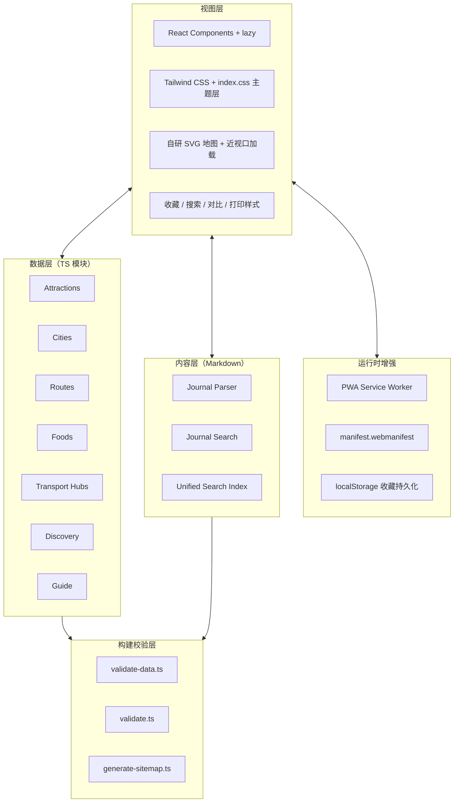

# 宁夏旅游地图网站 - 技术架构文档

> v0.3.116 发布补充（2026-09-03）：地图工具栏使用 `map-toolbar-in`、`map-breadcrumb-in`、`map-control-in`、`map-control-pressed`、`map-level-label-in` 和 `map-level-ink` 完成工具栏、层级、控制按钮和图层启用的渐进绘图；层级标签通过 `key` 在城市/区县切换时重新触发绘图，`prefers-reduced-motion` 下恢复静态工具栏与墨线，地图操作逻辑不变。
> v0.3.115 发布补充（2026-09-03）：站点头部使用 `site-header-in`、`site-brand-mark-stamp` 和 `site-nav-ink` 完成整体入场、品牌标识落印与当前导航墨线；`prefers-reduced-motion` 下恢复静态头部与当前导航墨线，导航、收藏、搜索和移动端菜单逻辑不变。
> v0.3.114 发布补充（2026-09-03）：首页中段使用 `home-section-in`、`home-copy-in`、`home-control-in`、`home-card-in`、`home-action-in`、`home-note-in` 和 `home-section-title-ink` 按区块、标题、控件、内容卡片与行动入口分层呈现；`prefers-reduced-motion` 下恢复静态显示，筛选与链接逻辑不变。
> v0.3.113 发布补充（2026-09-03）：公共状态使用 `state-shell-in`、`state-icon-in`、`state-copy-in`、`state-title-ink`、`state-action-in`、`state-visual-in`、`toast-in` 和 `notice-in` 按反馈层级渐进绘图；`prefers-reduced-motion` 下恢复静态内容与墨线，状态组件与操作逻辑不变。
> v0.3.112 发布补充（2026-09-03）：集合页使用 `collection-panel-in`、`collection-ink-line`、`collection-theme-in`、`collection-filter-in`、`collection-comparison-in`、`collection-table-row-in`、`collection-card-in` 和 `collection-chip-in` 按阅读层级呈现；关于本站使用 `about-intro-in`、`about-method-in`、`about-source-in` 与 `about-source-link-in`；`prefers-reduced-motion` 下统一静态显示。
> v0.3.111 发布补充（2026-09-03）：收藏页与搜索页使用 `utility-copy-in`、`utility-title-ink`、`utility-visual-in`、`utility-form-in`、`utility-summary-in`、`utility-group-in`、`utility-row-in` 和 `utility-result-in` 按内容层级呈现；`prefers-reduced-motion` 下统一静态显示，收藏与搜索逻辑不变。
> v0.3.110 发布补充（2026-09-03）：`RouteDetail` 使用 `route-detail-copy-in`、`route-detail-visual-in`、`route-detail-title-ink`、`route-detail-fact-in`、`route-day-nav-in`、`route-day-marker-in`、`route-day-marker-ink` 和 `route-sidebar-in` 按阅读层级呈现路线详情；`prefers-reduced-motion` 下统一静态显示，DAY 环线为非交互装饰。
> v0.3.109 发布补充（2026-09-03）：详情页共享 `detail-hero-photo-in`、`detail-copy-in`、`detail-title-ink`、`detail-info-in` 与 `detail-side-in`；景点/美食/五城列表卡片使用 `collection-card-in`，美食与集合页视觉使用对应 hero 入场动画；`prefers-reduced-motion` 下统一静态显示。
> v0.3.108 发布补充（2026-09-03）：`Journal` 为列表卡片注入 `--journal-card-delay`，使用 `journal-card-in` 与 `journal-card-title-ink` 错峰入场；`JournalDetail` 使用 `journal-detail-photo-in`、`journal-detail-title-in`、`journal-detail-block-in`、`journal-detail-body-in` 和 `journal-sidebar-in` 分层呈现；`prefers-reduced-motion` 下统一静态显示。
> v0.3.107 发布补充（2026-09-03）：`TravelGuide` 为四季/天数卡片与交通节点注入索引变量，使用 `guide-card-in`、`guide-card-title-ink`、`guide-transit-line-draw` 和 `guide-flow-icon-stamp` 实现按阅读方向的 CSS 绘图；清单勾选使用 `guide-check-draw`，`prefers-reduced-motion` 下统一静态显示。
> v0.3.106 发布补充（2026-09-03）：`Home` 为 `.home-route-match` 注入 `--home-route-index`，使用 `home-route-match-in` 按结果顺序入场，并以 `h3::after` 的 `home-route-title-ink` 展开标题墨线；`prefers-reduced-motion` 下静态显示。
> 当前实现快照已更新至 v0.3.106：首页山河绘图分层入场、首页路线结果绘图、地图区域入场、地图视口过渡、路线轨道与节点落印、地图图层入场、区域聚焦墨线、选中点位墨线和公共反馈层继续使用统一的响应式与动效约束；地图数据、搜索索引和内容核验机制不变。
> v0.3.105 发布补充（2026-09-03）：`AttractionLayer` 仅在选中景点时渲染独立 `marker-ink-ring` SVG 圆环，使用 `pathLength="1"` 与 `marker-ink-ring-draw` 完成轻量手绘反馈；装饰不参与交互，`prefers-reduced-motion` 下静态显示。
> v0.3.104 发布补充（2026-09-03）：路线详情 `.stop-number::after` 使用 `route-stop-ink-ring` 按 `--route-stop-index` 错峰绘制手绘环线；时段细节复用 `.stop-number--slot` 作为非编号节点，装饰不参与交互，`prefers-reduced-motion` 下静态显示。
> v0.3.103 发布补充（2026-09-03）：`MapRegionLayer` 在聚焦或选中区域时渲染独立的 `map-region-emphasis` 装饰路径，使用 `pathLength="1"` 与 `map-region-emphasis-draw` 沿边界展开；装饰路径不参与交互，`prefers-reduced-motion` 下静态显示。
> v0.3.102 发布补充（2026-09-03）：首页 `.mountain-back`、`.mountain-front`、`.hero-seal` 与 `.scroll-cue` 分别使用 `hero-mountain-back-in`、`hero-mountain-front-in`、`hero-seal-stamp` 和 `hero-scroll-cue-in` 按层级延迟入场；`prefers-reduced-motion` 下关闭动画并保留原始构图。
> 当前实现快照已更新至 v0.3.102：首页山河绘图分层入场、地图区域入场、地图视口过渡、路线时间线绘图、地图图层入场、选中点位和公共反馈层继续使用统一的响应式与动效约束；地图数据、搜索索引和内容核验机制不变。
> v0.3.101 发布补充（2026-09-02）：标签与地图点位采用定位层/局部图形两级 SVG 结构，局部图形使用 `map-layer-pop-in` 和 `--map-layer-index` 错峰入场；区域坐标、键盘/触控交互不变，`prefers-reduced-motion` 下关闭局部图形动画并恢复静态。
> 当前实现快照已更新至 v0.3.101：首页绘图、地图区域入场、地图视口过渡、路线时间线绘图、地图图层入场、选中点位和公共反馈层继续使用统一的响应式与动效约束；地图数据、搜索索引和内容核验机制不变。
> v0.3.100 发布补充（2026-09-02）：路线详情在 `.route-stops` 上使用伪元素绘制纵向路线轨道，`.route-stop` 通过 `--route-stop-index` 生成错峰 `route-stop-in` 入场；窄屏调整轨道偏移，`prefers-reduced-motion` 下关闭动画并恢复静态状态。
> 当前实现快照已更新至 v0.3.100：首页绘图、地图区域入场、地图视口过渡、路线时间线绘图、选中点位和公共反馈层继续使用统一的响应式与动效约束；地图数据、搜索索引和内容核验机制不变。
> v0.3.99 发布补充（2026-09-02）：`useMapViewport` 暴露 `isDragging`，地图视口组使用 `transform` CSS 过渡；缩放、重置与层级切换平滑变换，拖拽期间通过 `.is-dragging` 关闭过渡保持即时跟手，`prefers-reduced-motion` 下关闭过渡。

> 当前实现快照已更新至 v0.3.99：首页绘图、地图区域入场、地图视口过渡、选中点位和公共反馈层继续使用统一的响应式与动效约束；地图数据、搜索索引和内容核验机制不变。

> v0.3.98 发布补充（2026-09-02）：首页 CSS 绘图使用 `sun-breathe`、`river-shimmer` 与 `orbit-drift-*` 增加低幅度动效；地图区域通过 `pathLength="1"`、递进 `animation-delay` 和 `map-region-draw` 实现描边入场，选中景点使用 `marker-pulse`；`prefers-reduced-motion` 下全部恢复静态绘图。

> 当前实现快照已更新至 v0.3.98：首页绘图、地图区域、选中点位和公共反馈层继续使用统一的响应式与动效约束；地图数据、搜索索引和内容核验机制不变。

> v0.3.97 发布补充（2026-09-02）：`.search-field input` 补齐 `min-height: 44px`，与景点/美食筛选下拉控件、全站搜索、手记搜索和主要操作共享触控基线；筛选面板布局与查询参数同步逻辑不变。

> 当前实现快照已更新至 v0.3.97：列表筛选输入、站点头部高度、地图控制、公共反馈层和详情操作继续使用统一的响应式约束；地图数据、搜索索引和内容核验机制不变。

> v0.3.96 发布补充（2026-09-02）：将 `.home-hero`、`.full-state` 与 `.offline-notice` 的头部相关固定高度改为 `var(--site-header-height)`，统一桌面 72px 与移动 64px 的响应式壳层基准；页面内容、离线提示样式和 Pages 回退机制不变。

> 当前实现快照已更新至 v0.3.96：站点头部高度、搜索输入、地图控制、公共反馈层和详情操作继续使用统一的响应式约束；地图数据、搜索索引和内容核验机制不变。

> v0.3.95 发布补充（2026-09-02）：`.site-search-form input` 增加 `min-height: 44px`，与 `.journal-search input`、移动筛选输入和全局按钮触控基线统一；外层搜索栏 56px 高度、清空按钮、桌面聚焦和移动端布局保持不变。

> 当前实现快照已更新至 v0.3.95：全站搜索、筛选、收藏与地图控制继续遵循统一的响应式触控约束；地图数据、搜索索引、内容核验和 Pages 回退机制不变。

> v0.3.94 发布补充（2026-09-02）：`@media (max-width: 480px)` 将 `.map-actions` 统一为三列网格，六个地图控制项在 320px、390px 下固定为两行；覆盖 `margin-right: auto` 的旧式弹性换行规则，并保持按钮最小触控尺寸与根页面宽度约束。

> 当前实现快照已更新至 v0.3.94：地图工具栏、底部景点预览面板、图例和筛选/收藏操作继续使用统一的响应式安全区与触控基线；地图数据、图层切换、内容核验和 Pages 回退机制不变。

> v0.3.93 发布补充（2026-09-02）：新增 `@media (max-width: 480px)` 的收藏条目收束规则，标题与副标题使用单行省略、路线摘要隐藏并收紧路线条目内边距；`@media (max-width: 360px)` 继续将收藏按钮设为 44×44 图标热区。

> 当前实现快照已更新至 v0.3.93：收藏列表与顶部收藏入口共享中窄屏内容收束和极窄屏图标化策略，保留 FavoriteButton 的 aria-label/title 语义；景点卡片、路线详情和行前指南继续共享响应式操作区收口规则，既有内容、数据核验和 Pages 回退机制不变。

> v0.3.92 发布补充（2026-09-02）：在 `@media (max-width: 360px)` 中将收藏页景点/路线条目的 `.favorite-button` 收口为 44×44 图标热区，标题和副标题使用单行省略，路线摘要隐藏，减少极窄屏条目高度波动。

> 当前实现快照已更新至 v0.3.92：收藏列表与顶部收藏入口共享极窄屏图标化策略，保留 FavoriteButton 的 aria-label/title 语义；景点卡片、路线详情和行前指南继续共享响应式操作区收口规则，既有内容、数据核验和 Pages 回退机制不变。

> v0.3.91 发布补充（2026-09-02）：在移动断点将 `.attraction-card .card-actions` 设为禁止换行，并保持末端 `.text-link` 可收缩，使景点卡片的对比与详情入口与美食、路线卡片共享单行操作节奏。

> 当前实现快照已更新至 v0.3.91：景点卡片极窄屏操作区与既有路线详情、行前指南操作区共享响应式收口策略；详情关联入口、搜索结果和城市详情关联卡片继续使用统一的交互与宽度约束，既有内容、数据核验和 Pages 回退机制不变。

> v0.3.90 发布补充（2026-09-02）：在 `@media (max-width: 360px)` 中将 `.guide-hero-actions` 设为 6px 间距、禁止换行，两个按钮使用 `flex: 1 1 0` 等宽分配并将横向内边距收紧至 4px。

> 当前实现快照已更新至 v0.3.90：行前指南与路线详情首屏操作区在极窄断点共享响应式收口策略，详情关联入口、搜索结果和城市详情关联卡片继续使用统一的交互与宽度约束；既有内容、数据核验和 Pages 回退机制不变。

> v0.3.89 发布补充（2026-09-02）：在 `@media (max-width: 360px)` 中将 `.guide-hero-actions` 设置为 6px 间距、禁止换行、子按钮等宽并收紧横向内边距至 4px，与 `.route-detail-actions` 共享极窄屏操作区规则。

> 当前实现快照已更新至 v0.3.89：行前指南与路线详情首屏操作区在极窄断点共享响应式收口策略，详情关联入口、搜索结果和城市详情关联卡片继续使用统一的交互与宽度约束；既有内容、数据核验和 Pages 回退机制不变。

> v0.3.88 发布补充（2026-09-02）：在 `@media (max-width: 360px)` 中将 `.route-detail-actions` 的间距设为 6px、禁止换行，并将按钮横向内边距收紧至 4px，使三个入口在 320px、360px 下保持同一行。

> 当前实现快照已更新至 v0.3.88：路线详情极窄屏操作区、详情关联入口、搜索结果和城市详情关联卡片共享统一的响应式与交互反馈规则；既有内容、数据核验和 Pages 回退机制不变。

> v0.3.87 发布补充（2026-09-02）：在 `@media (max-width: 360px)` 中将 `.route-detail-actions` 收紧为 6px 间距、禁止换行，并将三个入口的横向内边距设为 4px；极窄屏保持 44px 以上触控高度。

> 当前实现快照已更新至 v0.3.87：路线详情极窄屏操作区与详情关联、搜索结果箭头共享统一的响应式和交互反馈规则；既有内容、数据核验和 Pages 回退机制不变。

> v0.3.86 发布补充（2026-09-02）：`.nearby-grid` 与 `.search-result` 的末端 SVG 统一使用 `var(--green)`，并在 `:hover`/`:focus-visible` 时轻量右移 2px；卡片整体反馈与图标反馈保持分层。

> 当前实现快照已更新至 v0.3.86：详情关联入口、搜索结果和资料来源入口共享统一的末端箭头反馈；城市详情关联卡片继续在移动断点按内容列宽自适应，既有交互与内容核验规则不变。

> v0.3.85 发布补充（2026-09-02）：城市详情 `.city-attraction-row` 在移动断点将图片与首列同步为 100px，避免 320px、390px 窄屏下图片超过内容轨道；页面继续保持单列与根宽度不溢出。

> 当前实现快照已更新至 v0.3.85：城市详情关联卡片与五城概览、旅行手记、首页专题、景点、美食、推荐路线卡片继续共享统一的响应式节奏；既有交互与内容核验规则不变。

> v0.3.84 发布补充（2026-09-02）：`.city-card > div` 使用纵向 flex 布局，`.city-card > div > .text-link` 通过 `margin-top: auto` 将五城概览的城市指南入口按桌面网格行底部收口；移动端保留图片自适应与单列。

> 当前实现快照已更新至 v0.3.84：城市概览、旅行手记、首页专题、景点、美食与推荐路线卡片均采用纵向弹性布局，桌面端按网格行对齐行动入口；既有交互与响应式规则不变。

> v0.3.83 发布补充（2026-09-02）：`.city-card > div` 使用纵向 flex 布局，`.city-card > div > .text-link` 通过 `margin-top: auto` 将五城概览的城市指南入口按桌面网格行底部收口；移动端保留图片自适应与单列。

> 当前实现快照已更新至 v0.3.83：城市概览、旅行手记、首页专题、景点、美食与推荐路线卡片均采用纵向弹性布局，桌面端按网格行对齐行动入口；既有交互与响应式规则不变。

> v0.3.82 发布补充（2026-09-02）：`.journal-card` 与其内容区使用纵向 flex 布局，`.journal-card .text-link` 通过 `margin-top: auto` 将旅行手记行动入口固定在卡片底部；桌面双列按行对齐，移动端继续保持单列。

> 当前实现快照已更新至 v0.3.82：旅行手记、首页专题、景点、美食与推荐路线卡片均采用纵向弹性布局；`.journal-card` 在桌面双列中按行收口行动入口，移动端保持单列；既有交互与响应式规则不变。

> v0.3.81 发布补充（2026-09-02）：`.home-topic-card` 与其内容区使用纵向 flex 布局，`.home-topic-card .text-link` 通过 `margin-top: auto` 将首页旅行专题行动入口固定在卡片底部，与景点、美食、推荐路线卡片共享同一节奏规则。

> 当前实现快照已更新至 v0.3.81：首页旅行专题、景点、美食与推荐路线卡片均使用纵向弹性布局；首页专题在中屏保留末张卡片横向组合，移动端保持单列；桌面端各卡片行动入口按内容区底部收口，既有交互与响应式规则不变。

> v0.3.80 发布补充（2026-09-02）：`.attraction-card` 与 `.card-content` 使用纵向 flex 布局，`.card-content .card-actions` 通过 `margin-top: auto` 将景点与美食卡片行动入口固定在卡片底部，和 `.route-card` 使用同一节奏规则。

> v0.3.79 发布补充（2026-09-02）：`.route-card` 使用纵向 flex 布局，`.route-card > .text-link` 通过 `margin-top: auto` 将行动入口固定在卡片底部，保持桌面双列卡片的节奏一致。

> v0.3.78 发布补充（2026-09-02）：路线卡片 `.route-evidence-summary` 与景点详情 `.image-dots` 使用带名称的 `role="group"`，让非交互信息集合和多图选择器具有稳定的辅助技术边界。

> v0.3.77 发布补充（2026-09-02）：首页 `.hero-landscape` 使用 `role="img"` 与可访问名称表达山河主题图形；行前清单 `.checklist-progress` 使用 `role="progressbar"`、数值范围和实时数值，保持视觉进度条不变。

> v0.3.76 发布补充（2026-09-02）：在 `@media (max-width: 768px)` 中将 `.city-card` 与 `.city-card-image` 的最小宽度收口为 0，并移除图片最小高度约束，让 16:9 图片按网格列宽计算；320px E2E 检查图片、卡片与页面宽度不溢出。

> v0.3.75 发布补充（2026-09-02）：`MapControls` 为地图层级面包屑与地图控制区补充 `role="group"` 与独立 `aria-label`；区县图例按钮使用 `cursor: pointer` 与可操作行为保持一致；地图数据、图层状态和现有布局不变，E2E 覆盖双端语义。

> v0.3.74 发布补充（2026-09-02）：`RouteRecommendation` 为行程天数、涉及城市、旅行主题和行程节奏四个筛选容器补充 `role="group"` 与独立 `aria-label`；`NingxiaInteractiveMap` 将区县图例改为带可访问名称的按钮，并把临时图例高亮与地图区域键盘焦点分离；按钮的 `aria-pressed`、查询参数同步、地图数据和现有布局不变，E2E 覆盖双端交互。

> v0.3.73 发布补充（2026-09-02）：`LazyInteractiveMap` 的占位状态继续使用 `role="status"`，并新增与 `.map-canvas-wrap` 同源的沙纸渐变、点状纹理和 CSS 抽象轮廓；通过 Playwright 固定 `IntersectionObserver` 未触发场景检查文案与伪元素样式，正式地图懒加载与数据请求逻辑不变。

> v0.3.72 发布补充（2026-09-02）：`AttractionLayer` 将透明 `.marker-hit` 统一为 `r="38"`，与 `FoodLayer` 共享至少 44px 的实际屏幕触控范围；热区设为 `pointer-events: none`，由 `NingxiaInteractiveMap` 在画布捕获阶段按最近点位分发点击，避免相邻热区遮挡，并由双端 E2E 检查实际 `boundingBox` 与预览行为。

> v0.3.71 发布补充（2026-09-02）：`RouteFocusManager` 监听 pathname 变化，在桌面端将焦点交给应用外壳唯一的 `main#main-content`，并使用 `preventScroll` 避免改变已完成的滚动定位；移动端菜单按钮焦点作为例外保留，单元测试与双端 E2E 覆盖。

> v0.3.70 发布补充（2026-09-02）：`FoodLayer` 在交互模式下为每个美食点位增加 `r="38"` 的透明 `.marker-hit` 圆，手机端拥有与景点相近的触控范围；`.map-food--interactive:focus-visible` 将可见圆点切换为胡杨绿，纯展示模式不增加热区，组件测试与双端 E2E 覆盖。

> v0.3.69 发布补充（2026-09-02）：`Header` 为移动端导航入口增加统一的 `handleMobileNavigation`，点击菜单链接时立即关闭面板并将焦点回收到菜单按钮；路由变化后的既有关闭 effect、Escape、遮罩点击、焦点循环和滚动锁定继续保留，组件测试与移动端 E2E 覆盖完整路径。

> v0.3.68 门禁稳定性补充（2026-09-02）：首页完整筛选入口的 E2E 聚焦断言从直接 `focus()` 改为从天数单选控件按 Tab 进入，确保检查真实 `:focus-visible` 路径，避免 Chromium 环境将默认绿色误判为 hover 失败。

> v0.3.68 发布补充（2026-09-02）：`FoodDetail` 将分享操作区从 `route-detail-actions` 拆为 `food-detail-actions`，使浅色美食详情页不再继承路线深色头图的白字透明按钮规则；桌面与移动 E2E 均覆盖。

> v0.3.67 发布补充（2026-09-02）：`.route-detail-actions .favorite-button` 复用深色头图安静按钮的半透明背景、边框、阴影和聚焦反馈；已收藏态保留金色边框与文字状态，并由桌面与移动 E2E 覆盖。

> v0.3.66 发布补充（2026-09-02）：关于页 GitHub 内容审计入口统一指向 `docs/content/CONTENT_AUDIT.md`，并由桌面与移动项目的 E2E 检查完整 URL，避免文档目录调整后留下失效外链。

> v0.3.65 发布补充（2026-09-02）：`.journal-tabs` 使用 `flex`、`width: fit-content`、`max-width: 100%` 与 `overflow-x: auto`，栏目按钮保持 `flex: 0 0 auto`；E2E 在桌面与移动项目中以 320px 视口验证最后栏目可完整访问。

> v0.3.64 发布补充（2026-09-02）：`.city-table-wrap td:last-child .text-link` 与 `.route-table-wrap td:last-child .text-link` 使用 `min-width: 44px` 并居中对齐，和既有 `min-height: 44px` 规则组成统一的 44×44px 操作入口；E2E 覆盖桌面与移动项目。

> v0.3.63 发布补充（2026-09-02）：`.stop-body h3 a` 统一使用 `inline-block`、`min-height: 44px` 和垂直内边距，保留核实标签在同一标题行；E2E 在桌面与移动项目中覆盖路线详情停靠点名称入口。

> v0.3.62 发布补充（2026-09-02）：`.city-table-wrap tbody th a` 与 `.route-table-wrap tbody th a` 共用 `inline-flex`、`min-height: 44px` 和垂直内边距，保持比较表名称入口在桌面与移动端的触控节奏一致；回归覆盖两类表格。

> v0.3.61 发布补充（2026-09-02）：`src/index.css` 为 `.card-content h2 > a` 与 `.home-topic-card h3 > a` 提供统一的 `min-height: 44px` 和垂直内边距；E2E 在桌面与移动项目中覆盖景点、美食及首页专题卡片标题入口。

> v0.3.60 发布补充（2026-09-02）：`isNavigationPathActive` 统一顶部桌面导航、移动菜单与页脚的当前路径判断；页脚当前内容入口同步输出 `.active` 与 `aria-current="page"`，并由单元测试和双端 E2E 覆盖。

> v0.3.59 发布补充（2026-09-02）：新增 `src/lib/site-navigation.ts` 作为内容导航单一配置源，`Header` 的桌面/移动导航与 `Footer` 的“继续探索”均从该配置渲染；E2E 对比两处入口名称与路径，避免信息架构漂移。

> v0.3.58 发布补充（2026-09-02）：`Footer` 的“继续探索”与 `Header` 主导航保持六类内容路径一致，并将内容入口、资料说明分别包在带 `aria-label` 的 `nav` 中；页脚回归测试锁定关键路径与导航分组。

> v0.3.57 发布补充（2026-09-02）：`.city-table-wrap` 增加 `contain: paint` 隔离最小宽度表格的绘制溢出；容器保留 `overflow-x: auto`，移动端 E2E 同时断言内部滚动宽度大于可视宽度、页面根 `scrollWidth` 不超过视口。

> v0.3.56 发布补充（2026-09-02）：全局导航选择器将 `.mobile-nav a:hover` 纳入与桌面导航相同的反馈规则；移动菜单仍由实色面板、遮罩和入场动画构成，E2E 在动画结束后检查计算样式。

> v0.3.55 发布补充（2026-09-02）：`@media (max-width: 360px)` 下品牌链接保持 `white-space: nowrap`、收紧图文间距并隐藏视觉副标题；链接增加完整 `aria-label`，E2E 检查 320px 品牌高度与页面不横向溢出。

> v0.3.54 发布补充（2026-09-02）：`@media (max-width: 1024px)` 中将 `.favorites-hero` 的移动端 `padding-bottom` 从遗留的 300px 收口到 76px；E2E 在桌面端断言 58px、移动端断言 76px，并检查首个 `.favorites-section` 与英雄区的实际间距。

> v0.3.53 发布补充（2026-09-02）：`.toast`、`.sw-update-toast` 与 `.compare-dock` 统一在 `bottom` 计算中加入 `env(safe-area-inset-bottom, 0px)`，并在 480px 断点继续保留移动端原有紧凑间距；E2E 通过样式规则回归三类公共反馈层。

> v0.3.52 发布补充（2026-09-02）：`Loading` 在 `Suspense` 公共回退中使用品牌化 `.loading-mark` 地图印章，配合 `loading-mark-breathe` 轻量呼吸动效、`role="status"` 与可访问名称；全局 reduced-motion 规则继续将动效降为瞬时状态。

> v0.3.51 发布补充（2026-09-02）：`map-preview-in` 从移动端专属样式提升为 `.map-preview` 的跨端默认入场动效，移动端使用更长的上滑时长覆盖默认节奏；桌面端仍保持绝对定位，移动端继续覆盖 fixed 底部面板、把手和安全区。E2E 同时断言两种端型的动效名称与定位。

> v0.3.50 发布补充（2026-09-02）：`MapPreview` 增加仅移动端显示的 `.map-preview-handle`，并在固定底部面板上使用 `map-preview-in` 上滑入场动效；把手标记为 `aria-hidden`，不改变关闭按钮焦点、Escape 监听、安全区或触发点焦点恢复逻辑。单元测试与移动端 E2E 覆盖把手与动效。

> v0.3.49 发布补充（2026-09-02）：`Header` 在站点头部外渲染 `.mobile-nav-backdrop`，使用独立的 fixed 层遮挡并轻微虚化底层内容；`.mobile-nav` 提升至站点头部内部的更高层级并使用实色背景，避免英雄区文字透出。遮罩点击由既有外部点击关闭逻辑处理，单元测试与移动端 E2E 覆盖遮罩显示和关闭。

> v0.3.48 发布补充（2026-09-02）：`Header` 在菜单打开时暂存并锁定 `document.body.style.overflow`，组件清理、Escape、路由切换后恢复原值；`src/index.css` 将 `.mobile-nav` 设为相对站点头部的绝对悬浮面板，限制视口高度并使用统一纸张背景、阴影和 reduced-motion 动画。单元测试与移动端 E2E 覆盖锁定和恢复行为。

> v0.3.47 发布补充（2026-09-02）：`src/index.css` 通过 `--site-header-height` 与 `--route-day-nav-height` 统一站点头部、路线按天导航、日程 `scroll-margin-top` 和 DAY 标记的吸顶偏移；在 768px 与 480px 断点覆盖移动端高度，避免响应式头部变化造成遮挡或空隙。路线详情 E2E 同时检查目标日程位于吸顶安全区下方。

> v0.3.46 发布补充（2026-09-02）：`RouteDetail` 监听 `location.hash`，在懒加载内容完成后校验 `route-day-N` 并调用 `scrollIntoView({ block: 'start' })`，同时同步 `activeDay`；区块保留 `scroll-margin-top` 以避开 sticky 头部。v0.3.45 的 `RouteAnnouncer` 同时监听 pathname 与 search，让同路径查询条件变化也能重新播报。

> v0.3.43 发布补充（2026-09-02）：正式路由由 `AppRoutes` 统一提供唯一 `<main id="main-content">`，搜索、收藏及开发查看器页面不再嵌套第二个 `<main>`，并由 E2E 校验页面地标数量。

> v0.3.42 发布补充（2026-09-02）：移动端内容页首图通过统一 4:3 视觉框与 `object-fit: cover` 控制首屏节奏，保留原始来源说明和 alt 文本。

> v0.3.41 发布补充（2026-09-02）：GitHub Pages 发布源固定为 GitHub Actions，构建阶段通过 `npm run verify:pages-fallback` 校验 `404.html` 回退与前端地址恢复逻辑。

## 1. 架构设计概述

 v0.3.67 实现补充：路线详情深色头图中的打印、分享与收藏按钮复用半透明深色操作层级；收藏状态保留金色边框与文字反馈，桌面与移动端 E2E 均覆盖默认、悬停和聚焦样式。

本项目采用**单页应用（SPA）架构**，基于 React 18 + TypeScript + Vite 构建高性能静态前端应用。整体架构分为视图层、数据层、内容层、媒体资产层和构建校验层；当前部署目标为 GitHub Pages。

> 当前实现快照（2026-09-02，v0.3.78）：路线卡片核实概览与景点详情多图选择器补充带名称的语义分组；首页山河主题图形与行前清单进度补充标准可访问语义；五城概览的城市卡片图片在窄屏按卡片宽度自适应并保持 16:9 比例；地图层级面包屑与地图控制区分别使用 `role="group"` 与独立 `aria-label`，地图懒加载占位与正式画布共享沙纸色、纹理和抽象轮廓；路线筛选四组按钮容器分别使用 `role="group"` 与独立 `aria-label`，并继续通过 `aria-pressed` 暴露当前选择；页脚“继续探索”与顶部导航保持六类内容入口一致，并通过带标签的 `nav` 分组区分内容与资料入口；全站卡片、导航、极窄屏品牌栏、移动端菜单入口、导航搜索入口、筛选面板、路线筛选、景点兴趣筛选选中态、次级行动按钮、安静按钮、文字链接、清除/重置类文字操作、详情返回入口、资料来源入口、首页内容方法入口、搜索清空入口、搜索快捷关键词、比较结果入口、资料目录、PWA 更新提示、行前清单、行前清单进度、地图图层选中态、地图层级、首页探索、搜索快捷词、阅读资料入口、说明页目录、旅行手记栏目、详情页操作、结果区清除筛选、收藏入口触控热区、收藏操作、景点对比操作、深色头图按钮和轻量文字操作已统一视觉反馈；品牌首页入口保持至少 44px 触控高度，主导航、桌面搜索/收藏入口和移动导航通过 `aria-current="page"` 暴露当前页面，兴趣筛选与地图层开关通过 `aria-pressed` 暴露状态，主次行动按钮均保留各自主题色层级，导航搜索入口与收藏入口在文字隐藏后仍保持至少 44×44px 触控热区，搜索快捷关键词、比较结果入口、资料目录、结果区清除筛选与更新提示操作保持至少 44px 触控热区，安静按钮按浅色页面与深色头图环境使用对应阴影，文字链接、资料来源入口与首页内容方法入口仅对末端箭头或外链图标使用不超过 2px 的轻量位移以保持热区稳定，清除/重置类文字按钮与搜索清空按钮仅改变主题色、背景或阴影且不整体位移，搜索清空按钮保持 44px 触控热区，详情页返回入口仅移动左侧箭头且保持整体热区稳定，移动端菜单按钮保持 44px 触控尺寸，并使用实色面板、菜单外遮罩与背景虚化明确层级，地图景点预览在桌面端与移动端统一使用 `map-preview-in` 入场动效，移动端额外使用把手与安全区；旅行手记栏目在 320px 等窄屏下可横向浏览，关于页 GitHub 内容审计入口指向实际文档路径；发布验收记录见 [`docs/RELEASE_STATUS.md`](../RELEASE_STATUS.md)。

### 1.1 系统架构图



### 1.2 技术栈

| 层级 | 技术选型 | 版本 | 说明 |
|------|----------|------|------|
| 框架 | React | 18.3 | 核心框架 |
| 语言 | TypeScript | ~5.8 | 类型安全 |
| 构建 | Vite | 6.4 | 快速构建 |
| 样式 | Tailwind CSS + 自定义 CSS | 3.4 | Tailwind 基础层与 `src/index.css` 统一视觉令牌、组件样式 |
| 路由 | React Router DOM | 7.18 | SPA 路由 |
| 地图 | 自研 SVG + GeoJSON | — | 交互式地图，不依赖 Leaflet |
| Markdown | react-markdown + remark-gfm | 10.1 / 4.0 | 手记内容渲染 |
| 图标 | lucide-react | 0.511 | UI 图标 |
| 工具 | clsx + tailwind-merge | 2.1 / 3.6 | 样式合并 |
| 测试 | Vitest + Playwright | 3.2 / 1.55 | 单元测试 + E2E |
| 图片处理 | sharp | 0.35 | 多格式图片生成 |
| 性能审计 | Lighthouse + chrome-launcher | 13.4 | 移动端性能门禁 |
| YAML 解析 | yaml | 2.8 | 手记 Frontmatter |

---

## 2. 项目结构设计

```
ningxia-tourism-map/
├── public/
│   ├── data/
│   │   ├── ningxia-province.json        # 桌面端省级边界 GeoJSON
│   │   ├── ningxia-province-mobile.json # 移动端简化边界（0.003° 容差）
│   │   └── ningxia/districts/           # 五市地级区县边界
│   │       ├── yinchuan.json
│   │       ├── shizuishan.json
│   │       ├── wuzhong.json
│   │       ├── guyuan.json
│   │       └── zhongwei.json
│   ├── images/
│   │   ├── attractions/                 # 景点图片（webp + avif，720 / 1440 两档）
│   │   ├── foods/                       # 网络实拍美食照片与响应式版本
│   │   └── journal/editorial/           # 资料专题编辑插画
│   ├── 404.html                         # GitHub Pages SPA 深层链接回退
│   ├── favicon.svg
│   ├── og.jpg
│   ├── manifest.webmanifest             # PWA 清单
│   ├── sw.js                            # Service Worker（离线缓存）
│   └── robots.txt
│
├── src/
│   ├── components/
│   │   ├── map/                         # 地图模块（独立图层）
│   │   │   ├── config.ts                # 地图配置、政府标记、键盘工具
│   │   │   ├── projection.ts            # WGS84 → SVG 投影
│   │   │   ├── projection.test.ts
│   │   │   ├── useMapViewport.ts        # 缩放/平移 Hook（1-2.4x，±180px）
│   │   │   ├── MapRegionLayer.tsx       # 行政区域图层（点击高亮 / 跳转城市）
│   │   │   ├── AttractionLayer.tsx      # 景点图层（role=button，键盘可激活）
│   │   │   ├── FoodLayer.tsx            # 美食图层（有 onSelect 时 role=button）
│   │   │   ├── TransportLayer.tsx       # 交通枢纽图层（role=img，机场图标）
│   │   │   ├── GovernmentLayer.tsx      # 政府标记图层（role=img，导航锚点）
│   │   │   ├── MapLabelLayer.tsx        # 城市文字标签层
│   │   │   ├── MapControls.tsx          # 图层开关控件（aria-pressed）
│   │   │   ├── MapPreview.tsx           # 景点悬浮预览卡片
│   │   │   └── NingxiaInteractiveMap.tsx# 地图根组件（协调图层 + 视口）
│   │   ├── LazyInteractiveMap.tsx       # 近邻视口 IntersectionObserver 懒加载壳
│   │   ├── FavoriteButton.tsx           # 收藏按钮（localStorage 驱动）
│   │   ├── ErrorBoundary.tsx            # 路由级错误边界
│   │   ├── Footer.tsx
│   │   ├── Header.tsx                   # 主导航（含收藏计数、搜索入口）
│   │   ├── Header.test.tsx
│   │   ├── Loading.tsx                  # Suspense / 懒加载占位
│   │   ├── NetworkStatus.tsx            # 在线 / 离线状态提示
│   │   ├── ResponsiveImage.tsx          # 响应式图片（webp/avif，eager/high 主图）
│   │   ├── ResponsiveImage.test.tsx
│   │   ├── SEO.tsx                      # SEO meta / OG / JSON-LD 组件
│   │   ├── SEO.test.tsx
│   │   ├── ServiceWorkerUpdate.tsx      # SW 更新提示
│   │   └── ErrorBoundary.test.tsx / FavoriteButton.test.tsx / NetworkStatus.test.tsx
│   │
│   ├── content/
│   │   ├── journal/                     # 手记 Markdown 源文件
│   │   ├── article-templates.ts         # 模板解析（用于 new:article CLI）
│   │   ├── article-templates.test.ts
│   │   ├── journal-parser.ts            # 构建时解析 Markdown + Frontmatter
│   │   ├── journal-search.ts            # 手记搜索索引
│   │   ├── journal-search.test.ts
│   │   ├── journal.ts                   # 手记数据服务
│   │   └── journal.test.ts
│   │
│   ├── data/                            # 数据唯一源（TS 模块，非 JSON）
│   │   ├── attractions.ts               # 22 published + 草稿
│   │   ├── cities.ts                    # 5 个地级市
│   │   ├── routes.ts                    # 9 条路线，逐日 timeSlots 全覆盖
│   │   ├── foods.ts                     # 14 道美食（2 verified + 12 review）
│   │   ├── transport.ts                 # 8 个交通枢纽
│   │   ├── discovery.ts                 # 4 组旅行兴趣组合
│   │   ├── guide.ts                     # 行前指南（四季 / 跨城 / 清单）
│   │   ├── meta.ts                      # 站点元信息
│   │   ├── validate.ts                  # 数据校验逻辑（ID / 时效 / 引用）
│   │   ├── validate.test.ts
│   │   └── guide.test.ts
│   │
│   ├── lib/                             # 工具函数与通用 Hook
│   │   ├── favorites.tsx                # 收藏状态 / localStorage
│   │   ├── favorites.test.tsx
│   │   ├── route.ts                     # 路由辅助
│   │   ├── route.test.ts
│   │   ├── site.ts                      # 站点配置（base URL、站点名等）
│   │   ├── site.test.ts
│   │   ├── useSearchParamsFilter.ts     # URL 筛选 Hook（journal/attractions 复用）
│   │   ├── useSearchParamsFilter.test.tsx
│   │   ├── useShare.tsx                 # 分享 Hook（Web Share API + 剪贴板回退）
│   │   ├── useShare.test.tsx
│   │   └── utils.ts
│   │
│   ├── pages/                           # 页面组件（React.lazy 懒加载）
│   │   ├── Home.tsx                     # 首页：SVG 地图 + 1—5 天路线匹配 + 最近专题
│   │   ├── AttractionsList.tsx          # 景点列表：城市/类型/兴趣筛选 + 横向对比
│   │   ├── AttractionDetail.tsx         # 景点详情：图库、开放信息、来源、周边、收藏
│   │   ├── FoodsList.tsx                # 美食列表：分类/城市筛选
│   │   ├── FoodDetail.tsx               # 美食详情：介绍、餐厅、来源
│   │   ├── CityOverview.tsx             # 城市概览 / 单城市详情
│   │   ├── RouteRecommendation.tsx      # 路线推荐：1—5 天筛选 + 城市筛选
│   │   ├── RouteDetail.tsx              # 路线详情：逐日时间槽 + 打印样式
│   │   ├── Journal.tsx                  # 手记列表：搜索 + 筛选 + 栏目计数
│   │   ├── JournalDetail.tsx            # 手记详情：Markdown + 来源 + 适用范围
│   │   ├── TravelGuide.tsx              # 行前指南
│   │   ├── About.tsx                    # 关于 + 信息边界
│   │   ├── Search.tsx                   # 统一搜索：景点 / 美食 / 城市 / 路线 / 专题
│   │   ├── Search.test.tsx
│   │   ├── Favorites.tsx                # 我的收藏：localStorage 列表
│   │   ├── Favorites.test.tsx
│   │   ├── NotFound.tsx                 # 404
│   │   ├── GeoJSONViewer.tsx            # 开发查看器（DEV only）
│   │   └── GeoJSONEditor.tsx            # 开发编辑器（DEV only）
│   │
│   ├── test/
│   │   └── setup.ts                     # Vitest 测试配置（jsdom + Testing Library）
│   │
│   ├── types/
│   │   ├── index.ts                     # 全局类型定义（联合类型禁止 | string）
│   │   └── geojson.d.ts                 # GeoJSON 类型声明
│   │
│   ├── App.tsx                          # 应用根组件 + 路由配置（Suspense + skip-link + 路由焦点管理）
│   ├── index.css                        # 全局样式 + Tailwind 指令 + CSS 变量
│   ├── main.tsx                         # 入口文件（生产环境注册 Service Worker）
│   └── vite-env.d.ts
│
├── scripts/                             # 构建辅助脚本（tsx 执行）
│   ├── validate-data.ts                 # 数据完整性 + 反糟粕门禁
│   ├── content-check.ts
│   ├── content-lint.ts                  # 手记 Frontmatter / 日期 / 占位文本 lint
│   ├── converted-cities.ts
│   ├── generate-sitemap.ts              # 构建期 sitemap（含景点/美食/路线/城市/手记）
│   ├── load-journal-files.ts            # 手记 MD → 对象（Vite 虚拟模块调用）
│   ├── new-article.ts                   # 基于 docs/templates 创建新手记
│   ├── process-images.ts                # sharp 批量生成 WebP/AVIF（单文件 + 递归批量）
│   ├── run-lighthouse.ts                # Lighthouse 多 URL 移动端性能门禁（≥ 0.9）
│   ├── simplify-geojson.ts              # GeoJSON 边界坐标简化
│   └── validate-data.ts
│
├── tests/
│   └── e2e/
│       └── tourism.spec.ts              # Playwright E2E：桌面 + 移动端双 viewport
│
├── docs/                                # 文档与模板（详细见 docs/README.md）
│   ├── README.md                        # 文档总索引
│   ├── product/                         # 产品、架构、部署、计划、数据字典
│   ├── content/                         # 内容审计、图片来源、维护说明
│   └── templates/                       # 手记 / 探店 / 路线模板（不参与发布）
│
├── .github/workflows/deploy.yml         # GitHub Actions：12 步 → GitHub Pages
├── index.html
├── package.json
├── package-lock.json
├── tsconfig.json
├── tailwind.config.js
├── vite.config.ts                       # Vite + React + TS 路径 + 手记虚拟模块
├── playwright.config.ts
└── eslint.config.js
```

---

## 3. 路由定义

路由配置位于 `src/App.tsx`，所有页面组件通过 `React.lazy` 懒加载。

| 路由路径 | 页面组件 | 功能描述 | 参数 |
|----------|----------|----------|------|
| `/` | Home | 首页：交互式地图 + 路线匹配 + 最近专题 | — |
| `/attractions` | AttractionsList | 景点列表，支持城市/类型/兴趣筛选 + 横向对比 | — |
| `/attraction/:id` | AttractionDetail | 景点详情页 | id: 景点唯一标识 |
| `/foods` | FoodsList | 美食列表，分类/城市筛选 | — |
| `/food/:id` | FoodDetail | 美食详情页 | id: 美食唯一标识 |
| `/cities` | CityOverview | 五城概览 | — |
| `/city/:name` | CityOverview | 单城市详情 | name: 城市拼音 |
| `/routes` | RouteRecommendation | 路线推荐，支持 1—5 天 + 城市筛选 | — |
| `/routes/:routeId` | RouteDetail | 路线详情 + 打印样式 | routeId: 路线 ID |
| `/journal` | Journal | 手记列表，支持搜索与筛选 | — |
| `/journal/:type/:slug` | JournalDetail | 手记详情 | type: travel/food/guide, slug |
| `/search` | Search | 统一搜索：景点/美食/城市/路线/专题 | `?q=` 查询参数 |
| `/favorites` | Favorites | 我的收藏（localStorage 持久化） | — |
| `/guide` | TravelGuide | 行前指南 | — |
| `/about` | About | 关于页面 | — |
| `/dev/geojson` | GeoJSONViewer | GeoJSON 查看器（仅开发环境） | — |
| `/dev/editor` | GeoJSONEditor | GeoJSON 编辑器（仅开发环境） | — |

### 3.1 路由配置

```typescript
// src/App.tsx（节选）
const Home = lazy(() => import('./pages/Home'));
const AttractionDetail = lazy(() => import('./pages/AttractionDetail'));
const FoodDetail = lazy(() => import('./pages/FoodDetail'));
// ... 其余 lazy 导入

function AppRoutes() {
  return (
    <div className="site-frame">
      <Header />
      <main className="site-main" id="main-content">
        <Suspense fallback={<Loading />}>
          <Routes>
            <Route path="/" element={<Home />} />
            <Route path="/attractions" element={<AttractionsList />} />
            <Route path="/attraction/:id" element={<AttractionDetail />} />
            <Route path="/foods" element={<FoodsList />} />
            <Route path="/food/:id" element={<FoodDetail />} />
            <Route path="/cities" element={<CityOverview />} />
            <Route path="/city/:name" element={<CityOverview />} />
            <Route path="/routes" element={<RouteRecommendation />} />
            <Route path="/routes/:routeId" element={<RouteDetail />} />
            <Route path="/journal" element={<Journal />} />
            <Route path="/journal/:type/:slug" element={<JournalDetail />} />
            <Route path="/guide" element={<TravelGuide />} />
            <Route path="/about" element={<About />} />
            {GeoJSONViewer && <Route path="/dev/geojson" element={<GeoJSONViewer />} />}
            {GeoJSONEditor && <Route path="/dev/editor" element={<GeoJSONEditor />} />}
            <Route path="*" element={<NotFound />} />
          </Routes>
        </Suspense>
      </main>
      <Footer />
    </div>
  );
}
```

---

## 4. 数据模型定义

类型定义位于 `src/types/index.ts`，所有联合类型禁止以 `| string` 放宽。

### 4.1 景点数据结构

```typescript
export interface Attraction {
  id: string;                        // kebab-case ASCII
  status: 'published' | 'draft';    // published 进入公开页面
  verificationLevel: 'verified' | 'review';
  name: string;
  cityId: CityId;                    // 五个固定城市 ID
  locality: string;                  // 县区
  category: 'nature' | 'history' | 'religion' | 'experience';
  coordinates: { lng: number; lat: number };  // WGS84
  summary: string;
  highlights: string[];
  visitInfo: {
    openingHours: string;
    ticketPrice: string;
    reservation: string;
    duration: string;
    bestSeason: string;
    transportation: string;
    address: string;
  };
  images: AttractionImage[];        // 含 credit、license、sourceUrl
  nearbyIds: string[];               // 周边景点 ID
  sources: SourceRef[];              // 可核实来源
  verifiedAt: string;               // YYYY-MM-DD
  verificationNote: string;
  fallbackNote?: string;             // 待复核景点的替代方案
}
```

### 4.2 城市数据结构

```typescript
export interface City {
  id: CityId;
  name: string;
  pinyin: CityId;
  travelRole: string;               // 旅行角色定位
  connectionNote: string;           // 交通衔接说明
  suggestedStay: string;            // 建议停留
  arrivalNote: string;              // 抵达方式
  bestFor: string[];                // 适合人群
  planningTip: string;             // 行程提醒
  nickname: string;
  introduction: string;
  history: string;
  foods: string[];                  // 美食 ID 引用
  bestSeason: string;
  culture: string;
  image: AttractionImage;
}
```

### 4.3 路线数据结构

```typescript
export interface RoutePlan {
  id: string;
  name: string;
  theme: 'first-visit' | 'weekend' | 'panorama' | 'culture' | 'food';
  themeLabel: string;
  durationDays: number;
  durationLabel: string;
  audience: string;
  budget: string;
  bestSeason: string;
  pace: 'relaxed' | 'balanced' | 'intensive';
  walkingLevel: 'low' | 'medium' | 'high';
  transportSummary: string;
  summary: string;
  highlights: string[];
  days: RouteDay[];                 // 逐日行程
  verifiedAt: string;
}

export interface RouteDay {
  day: number;
  title: string;
  summary: string;
  stops: RouteStop[];               // 停靠点（含 attractionId 或 mapQuery）
  meals: string[];
  accommodation: string;
  timeSlots?: RouteTimeSlot[];      // 逐日时间槽
}
```

### 4.4 美食数据结构

```typescript
export interface Food {
  id: string;
  status: 'published' | 'draft';
  verificationLevel: 'verified' | 'review';
  name: string;
  category: 'mutton' | 'noodle' | 'snack' | 'drink' | 'fruit' | 'specialty' | 'staple';
  description: string;
  origin: string;
  bestSeason?: string;
  priceRange?: string;
  restaurants: Restaurant[];        // 餐厅不含 phone 字段
  tips?: string;
  sources: SourceRef[];
  verifiedAt: string;
}

export interface Restaurant {
  name: string;
  cityId: CityId;
  coordinates?: Coordinates;
  recommend?: string;
  // 注意：不含 phone 字段，运营信息由探店手记承载
}
```

### 4.5 交通枢纽数据结构

```typescript
export interface TransportHub {
  id: string;
  name: string;
  cityId: CityId;
  type: 'highspeed_rail' | 'railway' | 'bus' | 'airport';
  coordinates: Coordinates;
  description?: string;
  address?: string;
  phone?: string;                   // 仅有可核实来源时保留
  sources?: SourceRef[];
  verifiedAt: string;               // 必填，180 天有效期
}
```

### 4.6 手记数据结构

手记分为三种类型，共享公共字段，各有专有字段：

```typescript
export type JournalType = 'travel' | 'food' | 'guide';
export type JournalContentKind = 'firsthand' | 'editorial' | 'demo';

// 公共字段
export interface JournalCommon {
  slug: string;
  type: JournalType;
  status: ContentStatus;
  contentKind: JournalContentKind;
  featured: boolean;
  title: string;
  excerpt: string;
  author: string;
  publishedAt: string;
  updatedAt: string;
  cityId: CityId;
  locality: string;
  tags: string[];
  cover: AttractionImage;
  gallery: AttractionImage[];
  relatedAttractionIds: string[];
  relatedRouteIds: string[];
  body: string;                     // Markdown 正文
}

// 亲历游记
export interface TravelJournal extends JournalCommon {
  type: 'travel';
  tripDate: string;
  duration: string;
  transport: string;
  budgetNote: string;
  highlights: string[];
}

// 探店手记
export interface FoodJournal extends JournalCommon {
  type: 'food';
  visitedAt: string;
  venueName: string;
  cuisine: string;
  address: string;
  mapQuery: string;
  pricePerPerson: string;
  dishes: string[];
  queueNote: string;
  suitableFor: string;
  revisitNote: string;
}

// 资料专题
export interface EditorialJournal extends JournalCommon {
  type: 'guide';
  reviewedAt: string;
  scopeNote: string;
  keyPoints: string[];
  references: JournalReference[];
}
```

### 4.7 来源引用结构

```typescript
export interface SourceRef {
  label: string;
  url: string;
  kind: 'official' | 'image';
  level: 'direct' | 'directory' | 'homepage';
  coverage: ('overview' | 'visit' | 'location')[];
  checkedAt: string;                 // YYYY-MM-DD
}
```

### 4.8 政府标记

政府标记定义在 `src/components/map/config.ts`，不在 `src/data/` 中维护：

```typescript
export interface GovernmentMarker {
  id: string;
  name: string;
  level: 'province-capital' | 'city-capital';
  cityId?: CityId;
  coordinates: Coordinates;
  sources: SourceRef[];
  verifiedAt: string;               // 必填，180 天有效期
}
```

---

## 5. 核心组件设计

### 5.1 交互式地图系统

地图根组件 `NingxiaInteractiveMap` 负责渲染 SVG 地图和协调各图层。

**架构组成**：

| 模块 | 文件 | 职责 |
|------|------|------|
| 投影 | `projection.ts` | WGS84 经纬度 → SVG 坐标，GeoJSON 边界解析 |
| 视口控制 | `useMapViewport.ts` | 缩放（1—2.4 倍）、平移（±180px）、指针拖拽 |
| 懒加载壳 | `LazyInteractiveMap.tsx` | IntersectionObserver（320px 预加载）近视口加载地图 |
| 标签图层 | `MapLabelLayer.tsx` | 五市 / 区县文字标签，随地图缩放变换 |
| 区域图层 | `MapRegionLayer.tsx` | 五市行政区域渲染与高亮，点击跳转城市详情 |
| 景点图层 | `AttractionLayer.tsx` | 景点标记，`role="button"`，支持键盘激活 |
| 美食图层 | `FoodLayer.tsx` | 美食标记；有 `onSelect` 时为 `role="button"` 并可键盘激活，否则为纯展示 `role="img"` |
| 交通图层 | `TransportLayer.tsx` | 交通枢纽，`role="img"`，机场使用飞机图标 |
| 政府图层 | `GovernmentLayer.tsx` | 政府标记，`role="img"`，仅导航锚点 |
| 控件 | `MapControls.tsx` | 图层开关，`aria-pressed` 标记激活 |
| 预览 | `MapPreview.tsx` | 景点/美食悬浮卡片；移动端底部面板 + 安全区 + Escape |
| 根组件 | `NingxiaInteractiveMap.tsx` | 协调整合以上图层、视口与预览回调 |

### 5.2 地图视口 Hook

```typescript
// src/components/map/useMapViewport.ts
export default function useMapViewport() {
  const [zoom, setZoom] = useState(1);
  const [pan, setPan] = useState({ x: 0, y: 0 });

  const zoomIn = useCallback(() => setZoom(v => Math.min(2.4, v + 0.25)), []);
  const zoomOut = useCallback(() => setZoom(v => Math.max(1, v - 0.25)), []);

  // Pointer Events 实现拖拽平移
  const onPointerDown = (event: PointerEvent<SVGSVGElement>) => { ... };
  const onPointerMove = (event: PointerEvent<SVGSVGElement>) => { ... };

  return { zoom, pan, zoomIn, zoomOut, resetViewport, viewportHandlers };
}
```

### 5.3 地图投影

```typescript
// src/components/map/projection.ts
export interface GeoFeature {
  type: 'Feature';
  properties: { name?: string; fullname?: string; code?: string; pinyin?: string; };
  geometry: { type: 'Polygon' | 'MultiPolygon'; coordinates: ... };
}

// WGS84 经纬度 → SVG 像素坐标
export function project(lng: number, lat: number, bounds: GeoBounds, view: { width: number; height: number }) { ... }
```

---

## 6. 样式系统设计

### 6.1 Tailwind 配置

```javascript
// tailwind.config.js（节选）
export default {
  darkMode: "class",
  content: ["./index.html", "./src/**/*.{js,ts,jsx,tsx}"],
  theme: {
    extend: {
      colors: {
        primary: '#C4A35A',          // 沙金色
        secondary: '#2D5A4A',        // 胡杨绿
        accent: '#E85D4C',           // 枸杞红
        background: '#F5F2EB',        // 暖白色
        'text-primary': '#1A1A1A',
        'text-secondary': '#6B6B6B',
        'sand-light': '#E8DCC8',
        'sand-dark': '#B89B5D',
        'oasis': '#3D6B5A',
        'desert': '#D4A857',
      },
      fontFamily: {
        serif: ['Noto Serif SC', 'serif'],
        sans: ['Noto Sans SC', 'sans-serif'],
        decorative: ['Ma Shan Zheng', 'cursive'],
      },
      animation: {
        'marker-bounce': 'markerBounce 0.6s ease-out',
        'card-slide': 'cardSlide 0.3s ease-out',
        'fade-in': 'fadeIn 0.4s ease-out',
        'slide-up': 'slideUp 0.5s ease-out',
        'scale-in': 'scaleIn 0.3s ease-out',
        'pulse-glow': 'pulseGlow 2s ease-in-out infinite',
      },
      boxShadow: {
        'soft': '0 2px 8px rgba(0, 0, 0, 0.08)',
        'medium': '0 4px 16px rgba(0, 0, 0, 0.12)',
        'large': '0 8px 32px rgba(0, 0, 0, 0.16)',
        'glow': '0 0 20px rgba(196, 163, 90, 0.4)',
      },
    },
  },
}
```

### 6.2 全局 CSS

全局样式和 CSS 变量定义在 `src/index.css`，通过 Tailwind 指令引入。

---

## 7. 数据校验系统

### 7.1 构建期门禁

`npm run validate:data` 执行 `scripts/validate-data.ts` 和 `src/data/validate.ts`，覆盖以下校验：

| 门禁 | 检测内容 | 位置 |
|------|----------|------|
| 重复 JSON 双写 | `src/data/` 与 `public/data/` 不允许同名 JSON | `scripts/validate-data.ts` |
| 模板化电话 | 拒绝 `0951-12306` 等模板填充电话 | `src/data/validate.ts` |
| 类型安全削弱 | `export type` 联合类型禁止 `| string` | `scripts/validate-data.ts` |
| 异常 ID | 所有 `id` 必须符合 kebab-case ASCII | `src/data/validate.ts` |
| 电话区号匹配 | 交通枢纽电话区号必须与所在城市一致 | `src/data/validate.ts` |
| verifiedAt 过期 | 超过 180 天未复核的条目阻断构建 | `src/data/validate.ts` |
| 占位文本 | 拒绝"示例""演示用""待填写"等占位内容 | `src/data/validate.ts` |
| 跨数据引用 | 路线停靠点只能引用已发布景点 | `src/data/validate.ts` |
| 图片完整性 | 已发布景点和手记的图片必须有本地多格式文件 | `scripts/validate-data.ts` |

### 7.2 verifiedAt 时效性

- 格式：`YYYY-MM-DD`
- 不能晚于当前日期
- 有效期：**180 天**（`VERIFICATION_STALE_DAYS`），超期阻断构建
- 适用于：`Attraction`、`Food`、`TransportHub`、`RoutePlan`、`GovernmentMarker`

---

## 8. 性能优化策略

### 8.1 图片优化
- WebP + AVIF 双格式，720 和 1440 两档；封面提供普通缩略图 + 主图 1440
- 响应式图片组件 `ResponsiveImage`：默认 `lazy` + `async`；景点/城市/专题详情主图显式 `eager` + `fetchpriority="high"`
- 构建期校验图片文件完整性（webp + avif 同时存在）

### 8.2 代码优化
- 路由级别 `React.lazy` 代码分割，`Suspense` 统一 `<Loading />` 占位
- 地图图层组件全部 `React.memo`；父组件回调 `useCallback`，计算数组 `useMemo`
- 投影函数 `project` 用 `useMemo` 缓存；城市 / 路线列表使用 `useMemo`
- 地图近视口懒加载：`LazyInteractiveMap` 通过 IntersectionObserver（320px 根边距）加载根组件，避免首屏开销

### 8.3 构建优化
- 数据以 TypeScript 模块维护，不引入 JSON 解析运行时
- 手记 Markdown 在构建时通过 Vite 虚拟模块 `virtual:journal-content` 解析，运行时只发送纯数据
- Sitemap 在构建后生成（含景点 / 美食 / 路线 / 城市 / 手记公开条目）
- GeoJSON 简化：移动端使用 `ningxia-province-mobile.json`（0.003° 容差），坐标 4,891 → 2,121（约 50KB）

---

## 9. SVG 地图实现方案

### 9.1 地图数据

正式地图边界数据位于：
- `public/data/ningxia-province.json`：省级边界
- `public/data/ningxia/districts/*.json`：五市地级区县边界

首页地图和开发查看器（`/dev/geojson`）共同读取同一套数据。

### 9.2 投影实现

```typescript
// src/components/map/projection.ts
// WGS84 经纬度 → SVG 像素坐标
export function project(
  lng: number,
  lat: number,
  bounds: GeoBounds,
  view: { width: number; height: number }
): { x: number; y: number }
```

### 9.3 地图配置

```typescript
// src/components/map/config.ts
export const mapView = { width: 720, height: 920 } as const;

export const cityColors: Record<CityId, string> = {
  yinchuan: '#c89d4d',
  shizuishan: '#6f9b7d',
  wuzhong: '#d17c58',
  guyuan: '#718b69',
  zhongwei: '#b98656',
};

// 政府标记（6 个：1 个省级 + 5 个市级）
export const governmentMarkers: GovernmentMarker[] = [ ... ];

// 键盘激活工具
export const activateWithKeyboard = (event, action) => {
  if (event.key !== 'Enter' && event.key !== ' ') return;
  event.preventDefault();
  action();
};
```

---

## 10. 响应式断点设计

```javascript
// Tailwind 默认断点
// 移动端：< 768px
// 平板端：768px - 1199px
// 桌面端：≥ 1200px

// 响应式策略
// 移动端：底部弹出面板展示景点信息，汉堡菜单，兴趣卡横向滑动
// 平板端：弹出层展示，导航栏完整
// 桌面端：完整布局，侧边栏展示详情
```

---

## 11. 无障碍设计（a11y）

### 地图图层无障碍

- **可交互图层**（景点、美食）：`role="button"` + `onKeyDown`（Enter/Space 激活，通过 `activateWithKeyboard`）
- **纯展示图层**（政府标记、交通枢纽）：`role="img"` + 可读 `aria-label`，不加入键盘 Tab 顺序；只有景点、美食等可操作点位进入焦点顺序
- 图层开关使用 `aria-pressed` 标记激活状态

### 通用无障碍

- 语义化 HTML 结构
- 跳转链接 `skip-link`
- 路由切换公告 `aria-live="polite"`
- 路由路径变化后桌面端焦点移交至 `main#main-content`；移动端菜单跳转保留菜单按钮焦点
- 键盘导航支持
- 颜色对比度符合 WCAG AA 标准

---

## 12. 测试体系

### 12.1 单元测试（Vitest）

| 测试文件 | 覆盖范围 |
|----------|----------|
| `src/data/validate.test.ts` | 数据校验逻辑（ID、电话、verifiedAt 过期等） |
| `src/data/guide.test.ts` | 行前指南数据 |
| `src/content/journal.test.ts` | 手记解析 |
| `src/content/journal-search.test.ts` | 手记搜索 |
| `src/components/map/projection.test.ts` | 地图投影 |
| `src/components/SEO.test.tsx` | SEO 组件 |
| `src/lib/route.test.ts` | 路由辅助 |
| `src/lib/site.test.ts` | 站点配置 |

### 12.2 端到端测试（Playwright）

- 位于 `tests/e2e/tourism.spec.ts`
- 覆盖地图交互、图层切换、键盘无障碍、路线筛选、美食详情等场景
- 桌面端和移动端两个 viewport 均需通过

---

## 14. PWA 与离线

### 14.1 清单
- `public/manifest.webmanifest`：名称、短名、主题色（#C4A35A）、背景色（#F5F2EB）、`start_url`、图标（svg + 多尺寸）、`display: standalone`

### 14.2 Service Worker（sw.js）
- **预缓存**：`index.html`、`manifest.webmanifest`、`404.html`、Vite 构建产出的 `/assets/*`
- **运行时缓存**：
  - `public/data/*`（地图边界）：Stale-While-Revalidate
  - 图片（`/images/*`）：Cache First，最长 30 天
  - 页面 / API：Network First，失败回退首页
- **注册位置**：`src/main.tsx` 生产环境才注册；dev 不注册，避免本地调试干扰

### 14.3 用户提示
- `ServiceWorkerUpdate.tsx`：监听 SW `updatefound / waiting` 事件，顶部提示「有新版可用，点击刷新」
- `NetworkStatus.tsx`：监听 `online / offline`，离线时底部提示当前内容可能不完整

---

## 15. 收藏、对比与分享

### 15.1 收藏
- 存储：`localStorage` key = `nx-favorites-v1`，结构 `{ attractions: string[]; routes: string[] }`
- 服务层：`src/lib/favorites.tsx` 提供 `useFavorites()` Hook：增删、检查、计数、初始化同步
- UI：
  - `FavoriteButton.tsx`：心形图标按钮，实心 / 空心 + aria-label；详情页 / 卡片内复用
  - 导航栏显示 `♥ N` 数量
  - `/favorites` 页：分区展示景点收藏与路线收藏，支持空态提示

### 15.2 景点对比
- 位置：`AttractionsList` 顶部
- 容量：最多 3 个；超出自动禁用未选复选框
- 对比维度：类型、城市、门票、建议时长、最佳季节、预约方式、交通、核实等级、verifiedAt

### 15.3 分享
- `useShare.tsx`：优先 `navigator.share`（Web Share API），不支持时复制当前 URL 到剪贴板并 Toast 提示
- 分享元数据：`<SEO>` 组件写入 `title` / `description` / `og:image` / `og:type`

---

## 16. 统一搜索系统

### 16.1 搜索类型
- 五个索引：景点（名称 / 分类 / 城市 / 县区）、美食（名称 / 分类 / 起源）、城市（名称 / 别称 / 简介）、路线（名称 / 主题 / 标签）、手记（标题 / 摘要 / 标签 / 地点 / 正文关键词）

### 16.2 接口
- 页面：`/search?q=<keyword>`，使用 `useSearchParamsFilter` 同步 URL
- 组件：`Search.tsx` 分 Tab 或分组卡片展示命中结果；支持空态引导、清空按钮
- 组件测试：`Search.test.tsx` 覆盖 URL 同步、空态、分组计数

---

## 17. 路线打印样式

RouteDetail 页面通过 `@media print` 实现：
- 黑白高对比；去除背景图 / 阴影 / 动画
- 保留：标题、天数概览、逐日停靠点、timeSlots、餐饮、住宿、核实日期与来源
- 隐藏：Header / Footer / 筛选控件 / 收藏按钮 / 预览卡片 / 地图图层开关
- 手动触发：浏览器打印（Ctrl/Cmd + P）或页面「打印行程单」按钮调用 `window.print()`

---

## 18. 部署架构


### GitHub Actions 流水线

`.github/workflows/deploy.yml` 依次执行（完整 12 步详见 [DEPLOYMENT.md](./DEPLOYMENT.md)）：

1. Checkout + Setup Node 22 + npm 缓存
2. 依赖安装（`npm ci`）
3. 依赖安全审计（`npm run audit`，high 级阻断）
4. 数据校验（`npm run validate:data`）
5. TypeScript 类型检查（`npm run check`）
6. ESLint 代码检查（`npm run lint`）
7. 单元测试（`npm test`）
8. Playwright Chromium 安装（缓存命中跳过）
9. 端到端测试（`npm run test:e2e`）
10. 生产构建 + sitemap 生成（`npm run build`，注入 `VITE_BASE_URL=/ningxia-tourism/`）
11. Lighthouse 移动端性能门禁（≥ 0.9）
12. 非 PR 时上传 Pages artifact 并 deploy

`public/404.html` 为 GitHub Pages 提供 SPA 深层链接回退；Pages 发布源固定为 GitHub Actions，构建阶段通过 `npm run verify:pages-fallback` 校验回退产物与地址恢复逻辑。
